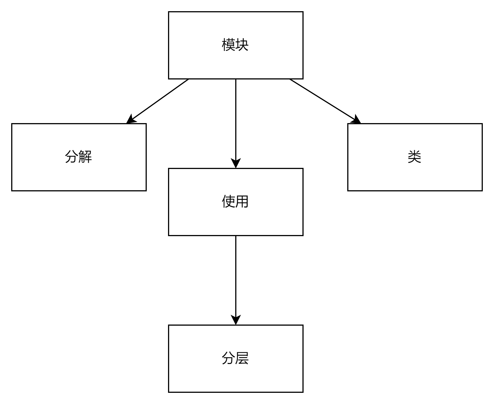
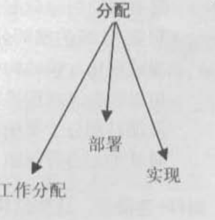
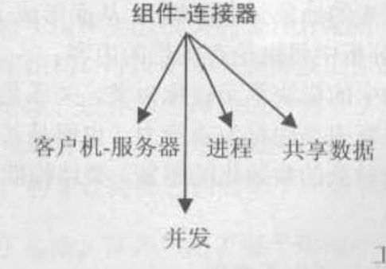
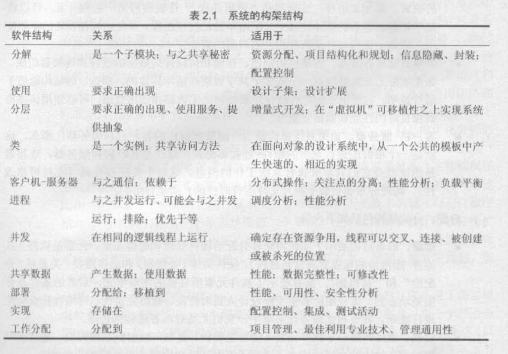
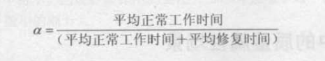

## 考纲

### The definition, concepts, and types of Module Structure, Allocation Structure, and C&C1.Structure.

#### Module Structure
* definition:

模块结构的基本元素是模块，是实现基本单元。模块表示一种考虑系统代码的方法，被分配功能责任区域。

type：
1. 分解：分解的结果是通过“是一个子模块”关系将彼此关联起来的模块，分解展示如何将较大的模块递归地分解为较小的子模块，直到足够小，可以被理解和实现。
2. 使用：模块、过程和模块接口上的资源，这些单元通过使用关系连接起来，称第一个单元使用第二个单元。模块结非常适合增量式开发，通过添加模块并通过使用关系连接进系统，实现系统的增量式开发。
3. 分层：当以一种特定的方式小地控制该结构的使用关系时，就出现了由层组成的系统。层是相关功能的一致的集合。把下层实现对上层隐藏起来，实现可移植性。
4. 类和泛化：模块结构中的模块具体实现为类。

#### Allocation structure

分类结构：展示软件元素和创建并执行软件的一个或多个外部环境中的元素之间的关系。问答的问题是：每个软件元素在什么处理器上执行？在开发、测试和系统构建期间，每个元素储存在什么文件中？分配给开发小组的软件元素是什么？

type：
* 部署：部署结构展示如何将软件分配给硬件处理和通信元素。元素是软件、硬件实体和通信路径，关系是分配给和移植到。
* 实现：实现结构展示软件元素是如何映射到系统开发、集成或配置控制环境中的文件结构上。
* 工作分配：工作分配结构将实现和集成模块的责任分配给适当的开发小组，可以使关于谁做该工作的决策具有管理上的和架构上的两层含义变得很清晰。

#### C&C Structure

该结构内的基本元素为运行时组件和连接器。该结构可以回答什么是主要执行组件、如何交互、共享数据存储、哪里可以并行运行。

type：
* 进程或通信进程：处理运行系统的动态方面，通过通信、同步和/或排除操作彼此相连的进程是基本单元。
* 并发：单元是组件、连接器是逻辑线程。逻辑线程是一系列的计算，可以将这些计算分配给不同的物理线程单独运行，从而不阻塞当前线程。
* 共享数据或存储库：该结构由创建、储存和访问持久数据的组件和连接器组成。展示软件元素如何产生和使用数据，可以使用该结构确保良好的性能和数据完整性。
* CS架构：系统被构建为一组彼此协作的客户机和服务器。组件是客户机和服务器，连接器是协议以及共享来执行系统工作的消息。

总结：

* 问题：
  * Seven categories of design decisions?

  * lts role in project risk reduction? (how to reduce risks?).
  
### The types, concepts, and tactics of OAs.
#### type 
一共有3类质量属性：系统的质量属性、受架构影响的商业属性、与架构本身相关的一些质量属性

重点讨论系统的质量属性：可用性、可修改性、性能、安全性、可测试性和易用性

#### concepts
##### 1. 可用性 Availability
可用性与系统故障及其相关后果有关。判断一个系统的可用性高，说明该系统不提供其规范中所说明的服务、发生系统故障的概率低。

* 关注内容：
  * 如何检测系统故障
  * 系统故障发生的频度
  * 出现故障时会发生什么情况
  * 允许系统有多长事件非正常运行
  * 什么时候可以安全地出现故障
  * 如何防止故障的发生以及发生故障时要求进行那种通知

定义：系统正常运行的时间比例

**可用性的一般场景：**
* 刺激源：刺激源分为外部和内部、对应刺激源的响应是不同的。
* 刺激：可能会发生的错误
  * 疏忽
  * 崩溃
  * 时间
  * 响应
* 制品：指定了要求具有极高可用性的资源：处理器、通信通道、进程或储存
* 环境：当出现错误、故障时，系统的状态会影响期望的系统响应。
* 响应：在出现系统故障时，对错误进行捕捉处理
* 响应量度：系统必须可用的时间间隔

##### 2. 可修改性 Modifiability

* 关注内容
  * 可以修改什么
  * 何时进行变更以及由谁进行变更

**可修改性的一般场景:**
* 刺激源：规定由谁来进行改变（开发人员、系统管理员、最终用户）
* 刺激：这部分指定了要进行的改变：增删改功能、优化系统质量、提高可用性
* 制品：指定要对什么进行改变：系统的功能、平台、用户界面、环境或者与之操作的另一个系统
* 环境：指定了什么时候可以进行改变（设计、编译、构建、启动、运行）
* 响应：理解如何改变、然后进行改变、测试和部署。
* 响应度量：根据所影响的元素的数量度量的成本、努力、资金；该修改对其他功能或质量属性所造成的影响的程度。

##### 3. 性能 Performance
性能与时间有关，事件发生时，系统必须对其做出响应。性能与将要耗费系统多长时间做出响应有关。

**性能的一般场景：**
* 刺激源：来自外部或内部。
* 刺激：事件的到来。
* 制品：系统的服务。
* 环境：正常模式、超载模式
* 响应：处理刺激：改变服务级别
* 响应度量：系统处理到达事件所用的时间（等待时间或必须处理的事件的期限）、该时间的变化（抖动）、在某一特定时间间隔内可以处理的事件数量（吞吐量）或对不能处理的事件的描述。（缺失值、数据丢失）

##### 4. 安全性 Security
安全性是衡量系统在向合法用户提供服务的同时，阻止非授权使用的能力。

**安全性的一般场景：**
* 刺激源：攻击源是人或者另一个系统。
* 刺激：攻击或试图违反安全性。
* 制品：攻击的目标可能是系统提供的服务、也可能是系统中的数据。
* 环境：在线或离线；联网或断网；有防火墙或没有防火墙
* 响应：对用户进行身份验证、隐藏用户的身份；阻止对数据和服务的访问；
* 响应度量：用成功的概率表示、避开安全防御措施所需要的时间、努力、资源；检测攻击的可能性；

##### 5. 可测试性 Testability
通过测试揭示软件缺陷的容易程度。

**可测试性的一般场景：**
* 刺激源：单元开发人员、增量集成人员、系统验证人员、客户验收人员、系统用户
* 刺激：已完成的分析、架构、设计、类和子系统集成；所交付的系统
* 制品：设计、代码段、完成的应用
* 环境：设计时、开发时、编译时、部署时
* 响应：提供对状态值的访问、提供所计算的值、准备测试环境
* 响应度量：一致性的可执行语句的百分比、如果存在缺陷出现故障的概率、测试用例的数量、测试用例的覆盖率

##### 6. 易用性 Usability

易用性关注的是对用户来说完成某个期望任务的容易程度和系统所提供的用户支持的种类。

**易用性的一般场景：**
* 刺激源：最终用户
* 刺激：最终用户想有效地使用系统，学习使用系统、把错误的影响减到最小，适配系统或对最低的一个示例。
* 制品：系统
* 环境：易用性所涉及的用户从是在运行时或系统配置时发生。
* 响应：系统应该为用户提供所需要的特性，或预计到用户的需要。
* 响应度量：用户学习系统所需的时间、用户在使用系统时所需的时间、用户在使用系统时所需的努力、用户在使用系统时所需的资源。

#### tactics

* 问题：
  * Availability and related tactics (e.g., how to detect faults?)
  * Performance and related tactics

### Architectural Pattern
* 问题：
  * P2P's definition, basic concepts, related QAs (e.g., availability and performance). weaknesses (how to improve?), strengths, and trade-offs.
  * mMapReduce 同上
  * Pipe-and-Filter 同上

### ATAM (architectural reasons), Participants' Roles, the usage of Utility Tree

### Open discussion.
* 例子：
  * The abstract common services tactic is intended to reduce coupling, but it alsomight reduce cohesion? 
  * Discuss the choice of programming language `(`an example of choice of technology`)` and its relation to architecture in general

### TestBook p409