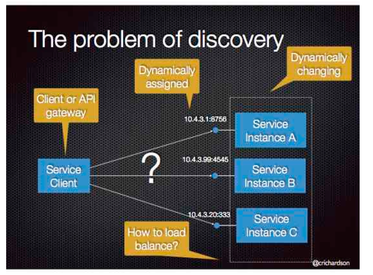

## 前言

将应用程序分解成多个微服务共同工作，为其提供服务，微服务部署在contain上，contain部署在具有负载均衡的服务器上，不同微服务之间通过api进行调用。相较于单体应用，微服务在系统的scale ability上有更佳的表现。

## 微服务简介

微服务的死对头：单体应用。所谓知己知彼，百战百胜。要想透彻的了解微服务的诞生，必须要明白单体应用的架构，优缺点。

Monolithic Application：所有功能模块整合在一个单一的代码库和部署单元中的应用程序，所有的组件都在一个系统中运行。

最常见的单体应用框架，Spring Boot。单体应用架构中有6个模块：WEB_UI API MYSQL_ADAPTER TWILIO_ADAPTER SENDGRID_ADAPTER STRIPE_ADAPTER。

这些模块定义了服务、领域对象和事件。围绕核心的与外部事件接口对接的适配器，包括数据库访问组件、生产和消费消息的消息组件暴露的API。单体应用部署服务器常用的负载均衡模式是冗余，通过运行多个副本来扩展应用。在并发数较少、用户量较少的前期阶段，它可以良好的运作。

### 单体应用的地狱

单体应用的架构和部署是简单的，但是有着很大的局限性。单体应用在业务上的成功会使得需求越来越多，系统随时间的推移变得越来越臃肿。一旦单体应用成为一个庞大、复杂的单体，可扩展会变得非常困难，可谓牵一发而动全身。任何优秀的软件架构师都无法架构出永远不会成为屎山的系统。根据可扩展性的定义：系统的扩大不会带来性能上的损失，单体应用的规模的扩大极易带来性能的下降，这从系统的启动时间就可以看出。除了可扩展性的问题，复杂的单体应用本身就是持续部署的障碍。

单体应用的另一个问题就是可靠性，由于所有的模块都运行在同一个进程中，任何一个模块的bug，都可能带来系统的崩溃。单体应用的重构是非常具有挑战的。

### 微服务——解决复杂问题

单体问题带来的大部分问题，在微服务架构中能够得到很好的解决。微服务的理念是将应用分家成一套较小的互联服务。

一个微服务通常实现一组不同的特性和功能，具有自己的六边形架构。微服务会暴漏工其他微服务或客户端消费的api。运行时，微服务实例会部署在云虚拟机或者docker容器上。服务之间可以通过异步、基于消息的通信、可以通过rest api进行通信。

客户端和后端之间的通信是通过称为api gateway负责的。api gateway负责负载均衡、缓存、访问控制、api度量和监控。后面会详细介绍api gateway。

### 微服务的缺点

* 服务的规模
* 服务间的通信
* 分区数据库架构
* 测试
* 部署服务发现机制
* PaaS 平台即服务：开发自己的PaaS：Kubernetes集群服务

## API Gateway

微服务架构中，每个微服务会暴露一组比较细颗粒的端点。

假设现在有个GET请求，在单体服务架构中，会发送到负载均衡服务器，服务器决定发送该请求到部署相同应用实例的服务器中的其中一个。相比于微服务架构，这个GET请求可能会涉及到很多微服务，因此客户端不会只发送一个GET服务，而是发送多个GET服务到各个实例中。

### 客户端与微服务的直接通信

每个微服务有一个暴露的REST API（端点），理论客户端可以直接调用某个微服务的api，但是通过直接调用不同api来实现某个服务，这样效率十分低下。

下面列举几个客户端直接与微服务端建立连接的几个缺点：

* 服务涉及的微服务请求多而杂，对客户端编写有难度
* 直接向微服务端发送请求不够安全
* 微服务架构不容易重构

由于上面的问题，在微服务架构下的客户端中，很少有客户端会直接向微服务端进行通信。

### 使用API gateway

下面来到本章节的重点，客户端和服务端通信的更好的方式是使用API gateway。API gateway是一个服务器，是系统的单入口点。它类似于面向对象设计模式中的Facade模式。

简单介绍一下Facade模式，防止有读者不了解这一经典的设计模式。Facade设计模式是提供一个统一的接口来访问一个子系统的一组接口。统一的接口称为高层接口。客户端与Facade对象通信，Facade管理下层接口。

API gateway的工作模式类似于Facade模式，API gateway是一组Facade门户，负责请求路由、组合和协议的转换。API gateway会调用多个微服务来处理一个请求并聚合结果。API gateway的作用其实可以简化为将一个web协议请求（http、web socket）转化为内部的非web协议的请求。

### API gateway的优劣
待补充

### 实现API网关

下面来聊聊API gateway如何设计。

API gateway负责将客户端请求分解成多个微服务请求，并route到对应的微服务器上。API gateway需要并发地处理这些微服务请求，这些微服务请求是彼此独立的。

如果遇到请求之间有依赖关系，则不能并发地处理请求，需要将api进行具有次序的组合。通常API gateway会异步地4处理这些请求，但是采用传统的异步回调方式，会在后期陷入回调地狱，代码充斥着各种回调，使得代码深色难懂。更好的办法是采用响应式方法以声明式方式编写API gateway代码。

#### 服务调用

基于微服务的应用是一个分布式系统，必须使用进程间通信机制。有两个进程通信方案，一是使用基于消息的异步机制，如JVM和AMQP，二是采用同步机制，如Http。API gateway需要支持各种通信机制以灵活应用。

#### 服务发现

API gateway需要知道其管理的每个微服务的位置（IP地址和端口）。这不是一件简单的事情，API 网关与系统中的其他客户端一样需哟啊使用系统的服务发现机制。后面会详细地介绍这部分内容。

#### 处理局部故障

什么是局部故障。在一个微服务架构系统中，当某个微服务不可用时，会发生局部故障，需要对故障进行故障处理。所有的分布式系统都有这个问题。如何处理局部故障取决于特定的方案和哪些服务发生故障。

API返回缓存数据也是处理局部故障的方式，当数据变化不大并且数据不可用时，可以返回缓存数据。

## 第三章-进程间通信

由于微服务是部署在多台机器上的分布式系统，每个服务实例都是一个进程，因此在不同进程间通信在微服务部署中扮演重要的角色。

### 交互方式

交互方式通常分为一对一和一对多：
* 一对一：每个客户端请求都有一个服务实例处理
* 一对多：每个客户端请求有多个服务实例处理

交互方式是同步的还是异步的：
* 同步：要求服务及时响应，会发生阻塞
* 异步：不会发生阻塞，因此请求不一定得到响应

根据上述交互方式，大致可分为几种情况：
**一对一：请求/响应、通知、请求/异步响应**
**一对多：发布/订阅、发布/异步响应**

### 定义API
定义api取决于你使用何种ipc机制。

### 演化API
微服务的api演化是非常困难的，新版本的微服务需要兼容低版本的客户端。

### 处理局部故障

先不考虑、带补充（🐶

### IPC技术

* 基于同步请求/响应的通信机制（基于HTTP的REST）
* 基于消息的异步通信机制（AMQP或STOMP）

#### 异步、基于消息的通信

进程通过异步交换消息进行通信。客户端通过发送消息向服务端发出请求；服务端如果需要回复，则向客户端发送单独的消息来实现。由于异步，客户端不会阻塞等待回复。

消息有header和body组成。两端endpoint通过channel连接。

* message channel：一端写，可以在另一端读。writer不需要知道reader是哪个具体的应用
type：point to point 、publish-subscribe

* point to point ：一对一
* publish-subscribe：一对多，把消息发布给所有注册订阅的消费者。

message channel 是非常值的研究的技术，之后会单开一篇文章来介绍常用的message channel 的设计模式。

#### 同步的请求/响应IPC
和单体模式下的请求形式差不多：REST HTTP

## 第四章-服务发现

由于微服务架构中的自动缩扩容问题，需要客户端进行更精确的服务发现机制，而不是简单地通过ip来确定。

### 客户端发现模式 Client-side service discovery

查询服务缓存，可以知道服务Location
