## 1 二进制

### 1.1 The Art of Managing Complexity

- Abstraction

隐藏不重要的细节

- Discipline 约束

一种内在限制，可以帮助我们更高度地抽象化

- The Three -y's
  - Hierarchy 层次化

系统划分为模块和子模块

  - Modularity 模块化

所有模块都有定义好的功能和接口

  - Regularity 规整化

模块追求uniformity，可以被reused

### 1.2 数制

**内容：**

进制数之间的转化：整数和小数

浮点数的IEEE格式化

可以去看计组或者计概的笔记

### 1.3 二进制运算

二进制加减、二进制原型的反码、补码

### 1.4 Logic Gates

常见的逻辑门有：NOT AND OR NAND NOR ，其中被分为单输入、多输入

#### 1.4.1 Logic Level

使用Discrete Voltages 来代表0（低电平）和1（高电平）

输入端和输出端的最小可视为高（低）电平的电压的差值（记住大减小即可）被称为噪声容限（noise margin），分为高电平噪声容限和低电平噪声容限

### 1.5 晶体管Transistor

- nMOS：接低电平 输入端0不可过、1可过
- pMOS：接高电平 输入端1可过、0不可过

组合成逻辑门：
- 非门
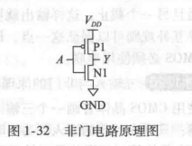
- 与非门：nMos串联，pMos并联
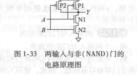
- 或非门：nMos并联，pMos串联
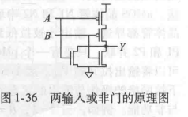
- 如果要构造与门或门，就在与非门和或非门输入端加上非门
- 要多输入就并串几个

## 2 组合逻辑电路

### 2.1 主题总览
- Boolean Equations
- Boolean Algebra
- From Logic to Gates
- Multilevel Combinational Logic
- X's and Z's
- Karnaugh Maps
- Combinational Building Blocks
- Timing

- node： A node is a wire, whose voltage conveys a discrete-valued variable
  - input
  - output
  - internal

### 2.2 Boolean Equations 布尔表达式

取反：A'；取与（积）：A.B；取或（和）：A+B

- 最小项Minterm：化简后全部积起来
- 最大项Maxterm：化简后全部和起来

**SOP form: 使用和式将与式连接起来的模式**
- 每一行都有最小项
- 所有的布尔表达式都可以写成SOPform
- 最小项之和
- Y值为1的需要

**POS form：使用积式将和式连接起来**
| A   | B   | max   |
| --- | --- | ----- |
| 0   | 0   | A+B   |
| 1   | 0   | A'+B  |
| 0   | 1   | A+B'  |
| 1   | 1   | A'+B' |
- 每一行都有最大项
- 所有的布尔表达式都可以写成POSform
- 最大项之积
- Y值为0的需要

**Normalterm form：变量只出现一次的式子**

### 2.3 Boolean Algebra 布尔代数
布尔运算规律
- 同一性：B·1=B；B+0=B；
- 零元律
- 重叠率
- 回旋
- 互补：B·B'=0；B+B'=1
- 交换律
- 结合律
- 分配律
- **吸收律**：**B·（B+C）=B；B+B·C=B**
- **合并律：（B·C）+（B·C'）=B；（B+C）·（B+C'）=B**
- **一致律：**
  - （B·C）+（B'·D）+（C·D）=（B·C）+（B'·D）
  - （B+C）·（B'+D）·（C+D）=（B+C）·（B'+D）
- 德摩根律

### 2.4 Schematic 逻辑电路原理图

按数电的经验来完成

### 2.5 Multilevel Combinational Logic
#### 2.5.1 Hardware Reduction

**NANDs和NORs的使用能提高效率，所以需要把布尔表达式化成与非或非式，这个翻译过程称为Circuit Manipulations**

使用前面介绍的布尔代数规律进行转换

#### 2.5.2 Bubble Pushing 气泡推进

大量的与非门和或非门使得表达式的阅读变得困难，使用气泡推进使得node两边要么没有取反要么都取反

原理：
- Y=（AB）’=A'+B'
- Y=（A+B）’=A'·B'
两种推进方式：
- Backward：

- Forward：


技巧：推进的时候，负号移动，变元器件

### 2.6 X和Z
- X
Content：电路尽力同时将输出置为1和0，此时输出值被称为X，也叫做非法值。

- Z
Floating 浮空值：Z表示某输出值既没有被驱动为0也没有被驱动为1，常见于三台缓冲器（带有enable的原件）

### 2.7 卡诺式图

目的：化简布尔表达式

详见数电

### 2.8 组合逻辑模块 Combinational Building Blocks

#### 2.8.1 Decorders 译码器

译码器是多输入、多输出的逻辑电路，用来把一段编码转换成另一段编码。

译码器有enable inputs，用来选择功能

常见的译码器有：N-to-2N Decoders
- N inputs and 2N outputs
- One-hot outputs：在一个时间段里只有多个输出中只有一个高电平

2-4 Decoder 的实现：
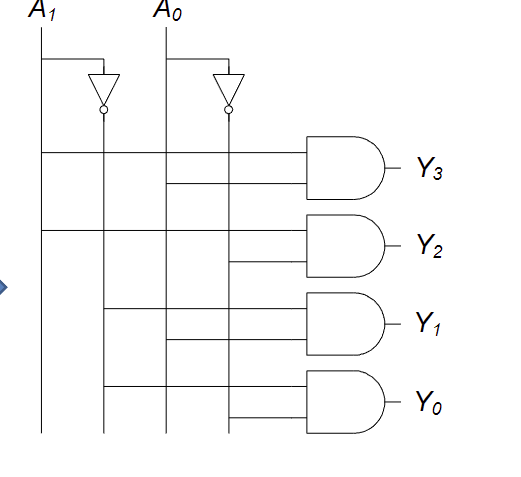

就是在输入端加一个置反的和不置反的一起加到AND门下，有多少个输出就有多少个AND门

可以使用decoder的输出来组合成各种各样的逻辑电路，因为一个a-b decoder 实际上就是ab的所有minterm的组合

#### 2.8.2 Multiplexers 多路复用器

与译码器的少变多不同，mux是在多个输入中选择特定的输入输出1，也就是多变少。
 
MUX不仅需要输入端，也需要选择端select（S） ，有N个select就选择2的N次方个输入连接输出

**4-to-1 MUX**

原理图：
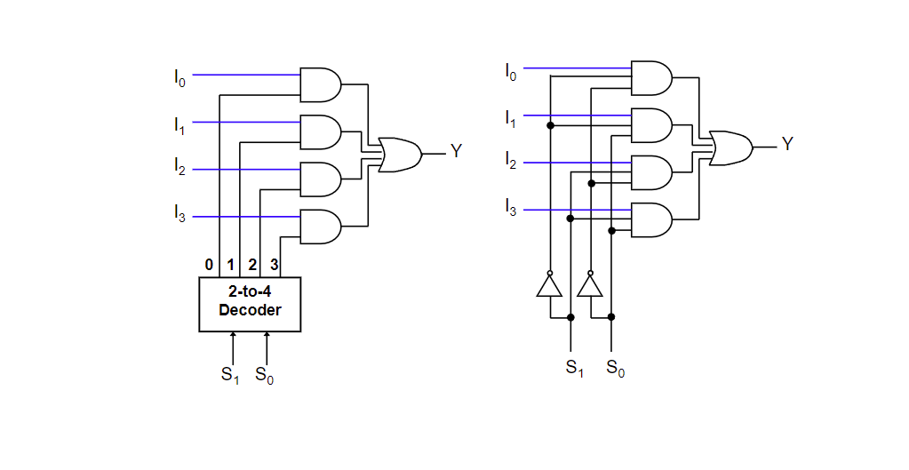

小的MUX可以组合成大的MUX

MUX可以使用lookup table来实现逻辑内容，Y=F（S1，S2，···），可以根据查找表决定要选择的输入，置为1，或者是逻辑变量也为 1的逻辑变量；其他的输入置为0或者逻辑变量也为0的逻辑变量；就可以实现逻辑表达式。

### 2.9 Timing 时序

- 输入改变后输出作出改变时发生的延迟
- Timing diagram（时序图）：描述一个电路在输入端发生变化时产生的瞬间变化。

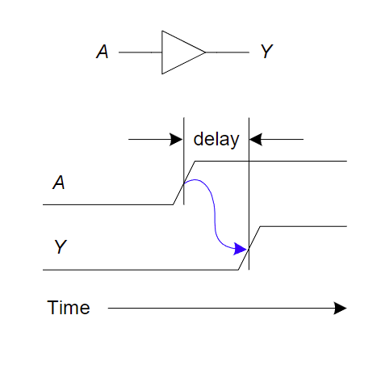

- Propagation delay（传播延迟）：tpd = 从input到output的最大延迟；
- Contamination delay（最小延迟）：tcd = 从input到output的最小延迟。

delay产生的原因：
- 电路中的电容和电阻
- 光速的限制

为什么tpd和tcd通常是不一样的：
- 上升沿延迟和下降沿延迟是不一样的
- 多个输入和输出之间延迟不同
- 电路的温度

- **Critical Path 关键路径**
the longest,slowest path
- **Short Path 最短路径**
the shortest,fastest path

**Glitch 毛刺**

当一次输入端改变引起输出端多次改变时就会发生毛刺

如何修正：

卡诺式图的圈连接起来

## 3 时序逻辑电路

主题：
- Latches and Flip-Flops
- Synchronous Logic Design
- Finite State Machines
- Timing of Sequential Logic
- Parallelism

时序逻辑电路的输出取决于之前的输入和当前的输入，所以具有记忆功能memory。

- state：记住之前的输入，就是当前电路的状态
- Latches and flip-flops：储存一个状态的状态元素集合
- synchronous sequential circuits：由flip-flops组合成的组合逻辑电路

### 3.1 锁存器Latch

**Bistable Circuit：双稳态元件，可以输出一正一反两个输出，没有输入，用于储存。**

- **SR Latch SR锁存器**

特性：S是set位，R是reset位，S=1R=0时Q被设置为1，当S=0R=1时Q被重置为0；S=0R=0时Q保持不变，储存；S=1R=1是非法状态

- **D Latch D锁存器**

特性：
- 两个输入：D和CLK时钟信号
- 当CLK=1时，Q变成和D一样；当CLK=0时，Q保持不变

### 3.2 触发器flip-flops
- **D Flip-Flop**

D寄存器，两个输入：CLK和D；CLK上升沿时，D赋值给Q；CLK下降沿时，保持。

注意和D Latch的区别：D锁存器是在CLK是1时候发生作用，在这期间D的变化都会引起Q的变化；而D触发器只有在CLK上升时，时间只有一刹那。

**Enable Flip-flops 带使能端的触发器**

当E是1时，触发器是普通的触发器；当E是0时，触发器只有保持功能。

**Resettable Flip-Flops 带重置端的触发器**

当Reset=1时，Q被重置为0；当Reset=0时，触发器为普通的D触发器

两种类型：
- Synchronous 同步的：只有在CLK上升沿发生作用
- Asynchronous 异步的：即时的

**Settable Flip-Flops 带重置端的触发器**

当Set=1时，Q被重置为1；当Set=0时，触发器为普通的D触发器

两种类型：
- Synchronous 同步的：只有在CLK上升沿发生作用
- Asynchronous 异步的：即时的

### 3.3 synchronous logic design 同步逻辑电路设计

特性：
- 使用寄存器来切开环路
- 寄存器保存着系统的状态
- 在上升沿时系统的状态发生改变
- 同步时序电路组成规则：
  - 所有的元件是寄存器或者组合元器件
  - 至少由一个元件是寄存器
  - 所有的寄存器都接收同一个时钟信号CLK
  - 所有的环路都有一个寄存器

两种常见的SSC：
- FSMs 有限状态机
- Pipeline 流水线

#### 3.3.1 必考重点：FSMs

组成：由M个输入，N个输出和k位状态。同时接收一个CLK和可选择的复位信号。

寄存器：

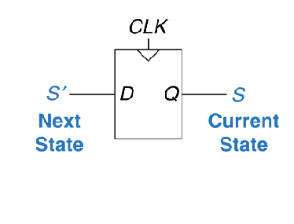

next在左，current在右！

FSM = next state logic + output logic

next state logic：用来产生下一个状态；
output logic：用来确定结束状态

两种常见的FSM：**Moore FSM 和 Mealy FSM**
- Moore FSM：output取决于当前state
- Mealy FSM：output取决于当前state和输入
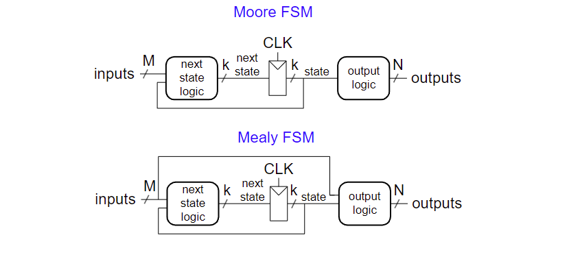

##### 3.3.1.1 Moore FSM

创建moore FSM的流程：

1. 根据实际情况确定状态集合以及状态转换条件，确定状态机图
2. 根据状态机图绘制状态转换表
3. 对状态和输出进行二进制编码
4. 使用状态的编码结果来表示状态转换表重写状态转换表，可以把输入拆开，写成卡诺图的形式，用卡诺图来化简
5. 根据这个表确定next state的布尔表达式，使用SOP form，最后对布尔表达式进行化简
6. 确定输出表
7. 根据这个表确定output state的布尔表达式，使用SOP form，最后对布尔表达式进行化简
8. 就可以根据next state和output state的布尔表达式进行电路设计

**上面步骤中的状态编码环节有别的方法：one-hot encoding**

对N个状态的编码有N位，其中只有一位是1

注意绘制状态机图的思想：
1. 先假设一个初始状态，这个状态表示输入对靠近结果没有作用时进入的状态
2. 针对不同的输入，初始状态会进入什么样的等待状态
3. 等待的值是输入值，就进入输出状态，这样所有的状态就确定完成
4. 确定每个状态的不同输入会导致进入什么状态

##### 3.3.1.2 Mealy FSM

Mealy FSM各个输出会被标记在弧上而不是当前状态上，表明其受输入和状态的影响。

创建Mealy FSM的步骤：
1. 同样是画出状态机图
2. 确定状态转换表
3. 对状态和输出进行编码
4. 重写状态转换表，可以把输入拆开，写成卡诺图的形式，用卡诺图来化简
5. 确定next state和output的布尔表达式
6. 设计电路

注意绘制状态机图的思想：
1. 先假设一个初始状态，这个状态表示输入对靠近结果没有作用时进入的状态
2. 针对不同的输入，初始状态会进入什么样的等待状态
3. 等待的值是输入值，就回到初始状态，连接的边上的输出为1
4. 确定每个状态的不同输入会导致进入什么状态

#### 3.3.2 FSM Factor 拆解

#### 3.3.3 重点：从一个电路推导出一个FSM（逆向）

**步骤：**
1. Examine circuit, **stating inputs**, **outputs**, and **state** bits.
2. Write** next state and output equations**.
3. Create **next state and output tables**.
4. Reduce the next state table to** eliminate unreachable 
states**.
5. Assign each valid state bit combination a **name**.
6. **Rewrite** next state and output tables with state names.
7. Draw state transition diagram.
8. State in words what the FSM does.

### 3.4 Timing of Sequential Logic

- Input Timing Constraints
  - Setup time 建立时间：时钟上升沿到前data稳定的时间
  - Hold time 保持时间：时钟上升沿到后data稳定的时间
  - Aperture time 孔径时间：setup time + hold time

- Propagation delay 传播延迟：tpcq 时钟上升沿到来后确定data保持稳定的时间
- Contamination delay 最小延迟：tccq 时钟上升沿到来后不稳定开始的时间

#### 3.4.1 Dynamic Discipline 动态约束

- 输入端数据在CLK上升沿到来时需要在孔径时间内保持稳定
- 特殊情况下，至少在CLK上升沿到来前的建立时间和后的保持时间内保持稳定

##### 3.4.1.1 Setup Time DIscipline

两个寄存器中间的延迟Tc >= tpcq + tpq + t-setup

=> tpd <= TC - tpcq - t-setup（tpd是寄存器之间组合逻辑电路传播延迟）（Tc是一次时钟周期）

(tpcq + tsetup): sequencing overhead

##### 3.4.1.2 Hold Time Discipline

t-hold < tccq + tcd (tccq是最小传播延迟，tcd是两个寄存器之间的组合电路的最小传播延迟)
tcd > t-hold -tccq 

#### 3.4.2 Timing Analysis

使用上面介绍的几个不等式对时序电路进行时序分析

一个时序电路的tccq、tpcq、t-setup、t-hold、tpd、tcd是确定的，求解建立时间约束和保持时间约束。前者计算查看Tc是否在约束内，后者计算查看t-hold是否在约束内。

#### 3.4.3 解决违反（不做要求）


## 4 硬件描述语言

主题：
1. Combinational Logic
2. Structural Modeling
3. Sequential Logic
4. More Combination Logic
5. Finite State Machines
6. Parameterized Modules
7. Testbenches

### 4.1 SystemVerilog Modules

模块分为两种：Behavioral（描述一个模型干什么）、Structural（描述一个模块这样从更简单的模块构成）

- **Behavioral Modeling**
y=a'b'c'+ab'c'+ab'c

SystemVerilog:
```
module example(input logic a,b,c, output logic y);
    assign y = ~a & ~b ~c | a & ~b & ~c | a & ~b & c;
endmodule
```

- module/endmodule:  required to begin/end module
- example:  name of the module
- Operators:
~:  NOT
&:  AND
|:  OR

- 仿真与综合

- **Structural Modeling - Hierarchy**

```
module and3(input  logic a, b, c,
            output logic y);
  assign y = a & b & c;
endmodule
module inv(input  logic a,
           output logic y);
  assign y = ~a;
endmodule
module nand3(input  logic a, b, c, output logic y);
  logic n1;                   // internal signal
  and3 andgate(a, b, c, n1);  // instance of and3
  inv  inverter(n1, y);       // instance of inv
endmodule

```

### 4.2 Combinational Logic 组合逻辑
如何使用HDL编写组合逻辑的行为模型

#### 4.2.1 Bitwise Operators 位运算符

```
module gates(input  logic [3:0]  a, b,
             output logic [3:0] y1, y2, y3, y4, y5);
   /* Five different two-input logic 
      gates acting on 4 bit busses */
   assign y1 = a & b;    // AND
   assign y2 = a | b;    // OR
   assign y3 = a ^ b;    // XOR
   assign y4 = ~(a & b); // NAND
   assign y5 = ~(a | b); // NOR
endmodule

```
[N-1:0] 表示一个N位的bus

#### 4.2.2 Reduction Operators 缩位运算符
表示作用在bus上的多输入门
```
module and8(input  logic [7:0] a, 
            output logic       y);
   assign y = &a;
   // &a is much easier to write than
   // assign y = a[7] & a[6] & a[5] & a[4] &
   //            a[3] & a[2] & a[1] & a[0];
endmodule
```

#### 4.2.3 条件赋值
```
module mux2(input  logic [3:0] d0, d1, 
            input  logic       s,
            output logic [3:0] y);
   assign y = s ? d1 : d0; 
endmodule
```
? :      is also called a ternary operator because it   
            operates on 3 inputs: s, d1, and d0.

#### 4.2.4 内部变量

可以理解为中间变量
```
module fulladder(input  logic a, b, cin, output logic s, cout);
  logic p, g;   // internal nodes
  assign p = a ^ b;
  assign g = a & b;
  
  assign s = p ^ cin;
  assign cout = g | (p & cin);
endmodule
```

内部变量实际上是小的逻辑电路

#### 4.2.5 Precedence 优先级
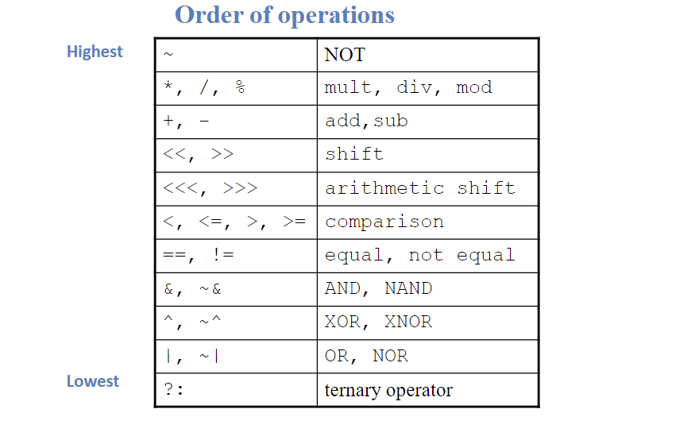

#### 4.2.6 Numbers
格式：N'Bvalue

- N=位数
- B=base（几进制）
- Number # Bits Base Decimal 

| Number | bits | Base    | Decimal | Stored |
| ------ | ---- | ------- | ------- | ------ |
| 3'b101 | 3    | binary  | 5       | 101    |
| 3'd6   | 3    | decimal | 6       | 110    |
| 6'o42  | 6    | octal   | 34      | 100010 |

#### 4.2.7 Z
- Z：Floating Output
```
module tristate(input  logic [3:0] a, 
                input  logic       en, 
                output tri   [3:0] y);
   assign y = en ? a : 4'bz;
endmodule

```

#### 4.2.8 Bit Manipulations 位操作
常常需要在总线的子集上操作，这些操作称为位操作，也叫位混合

#### 4.2.9 Delays

### 4.3 Sequential Logic 时序逻辑
- System Verilog 使用idioms来表述锁存器、触发器和状态机

**Always Statement**
```
always @(sensitivity list)
statement;

```
无论什么时候sensitivity list 里的事件发生时，statement执行

#### 4.3.1 寄存器
```
module flop(input  logic clk, input  logic [3:0] d, output logic [3:0] q);
always_ff @(posedge clk)
q <= d;                // pronounced “q gets d”
endmodule
```
#### 4.3.2 Resettable 寄存器
```
module flopr(input  logic clk, input  logic reset, input  logic [3:0] d, output logic [3:0] q);
// synchronous reset
always_ff @(posedge clk)
    if (reset) q <= 4'b0;
    else       q <= d;
endmodule
```
#### 4.3.3 Registers with Enable
```
module flopren(input  logic clk,input  logic reset, 
input  logic en, input  logic [3:0] d, output logic [3:0] q);
// asynchronous reset and enable 
always_ff @(posedge clk, posedge reset)
    if      (reset) q <= 4'b0;
    else if (en)    q <= d;
endmodule
```
#### 4.3.4 Multiple 寄存器
```
module sync(input logic clk, input logic d, output logic q);
    logic n1;
    always_ff @(posedge clk)
    begin
        n1 <= d; // nonblocking
        q <= n1; // nonblocking
    end
endmodule
```

#### 4.3.5 Latches 
```
module latch(input  logic clk, input  logic [3:0] d, output logic [3:0] q);
always_latch
    if (clk) q <= d;
endmodule
```

### 4.4 使用always语句的组合逻辑
```
// combinational logic using an always statement
module inv(input  logic [3:0] a, 
output logic [3:0] y);
    always_comb
        y = ~a;
endmodule
```

当=号的右边的变量发生变化时，always_comb下的语句就重新运算，always_comb就等于always@（*）

#### 4.4.2 case语句
case语句：和别的语言用法一样
```
module sevenseg(input  logic [3:0] data, 
output logic [6:0] segments);
always_comb
    case (data)
        //                     abc_defg
        0: segments =       7'b111_1110;
        1: segments =       7'b011_0000;
        2: segments =       7'b110_1101;
        3: segments =       7'b111_1001;
        4: segments =       7'b011_0011;
        5: segments =       7'b101_1011;
        6: segments =       7'b101_1111;
        7: segments =       7'b111_0000;
        8: segments =       7'b111_1111;
        9: segments =       7'b111_0011;
        default: segments = 7'b000_0000; // required
    endcase
endmodule
```
**别忘记了endcase语句**

#### 4.4.3 casez语句
看个例子就明白了
```
module priority_casez(input  logic [3:0] a, 
output logic [3:0] y);
    always_comb
    casez(a)
        4'b1???: y = 4'b1000;  // ? = don’t care
        4'b01??: y = 4'b0100;
        4'b001?: y = 4'b0010;
        4'b0001: y = 4'b0001;
        default: y = 4'b0000;
    endcase
endmodule
```

#### 4.4.4 if

### 4.5 辩：Blocking =  & Nonblocking <= Assignment
在时序电路中使用非阻塞；在组合电路中使用阻塞

### 4.6 信号赋值的原则
1. 时序逻辑电路使用：always_ff@(posedge clk) nonblocking assignment <=
2. 简单的组合逻辑电路使用assign
3. 复杂的组合逻辑电路使用always_comb blocking assignment =
4. 对一个信号的赋值旨在一个always语句或者连续赋值语句中，不要多次赋值

### 4.7 FSMs
常见的FSMs代码编写规范

背就完事了
- Divide by 3
```
module divideby3FSM (input  logic clk, 
input  logic reset, 
output logic q);
typedef enum logic [1:0] {S0, S1, S2} statetype;
statetype state, nextstate;  
// state register
always_ff @ (posedge clk, posedge reset)
if (reset) state <= S0;
else       state <= nextstate;
// next state logic
always_comb
case (state)
S0:      nextstate = S1;
S1:      nextstate = S2;
S2:      nextstate = S0;
default: nextstate = S0;
endcase
// output logic
assign q = (state == S0);
endmodule
```
- Moore FSM
```
module patternMoore(input  logic clk, 
input  logic reset, 
input  logic a,
output logic y);
typedef enum logic [1:0] {S0, S1, S2} statetype;
statetype state, nextstate;
// state register
always_ff @(posedge clk, posedge reset)
if (reset) state <= S0;
else       state <= nextstate;
// next state logic
always_comb
case (state)
S0: if (a) nextstate = S0;
else   nextstate = S1;
S1: if (a) nextstate = S2;
else   nextstate = S1;
S2: if (a) nextstate = S0;
else   nextstate = S1;
default:   nextstate = S0;
endcase
// output logic
assign y = (state == S2);
endmodul
```
- Mealy FSM
```
module patternMealy(input  logic clk, 
input  logic reset, 
input  logic a,
output logic y);
typedef enum logic {S0, S1} statetype;
statetype state, nextstate;
// state register
always_ff @(posedge clk, posedge reset)
if (reset) state <= S0;
else       state <= nextstate;
// next state logic
always_comb
case (state)
S0: if (a) nextstate = S0;
else   nextstate = S1;
S1: if (a) nextstate = S0;
else   nextstate = S1;
default:   nextstate = S0;
endcase
// output logic
assign y = (a & state == S1);
endmodule
```

### 4.8 Parameterized Modules 参数化的
2：1 MUX

```
module mux2
    #(parameter width = 8)  // name and default value
    (input  logic [width-1:0] d0, d1, 
        input  logic             s,
        output logic [width-1:0] y);
    assign y = s ? d1 : d0; 
endmodule
```

### 4.9 Test Bench 测试程序
测试程序是用于测试其他模块（device under test 被测设备）的硬件描述程序

有三种类型：
- simple
- self-checking
- self-checking with testvector

举个例子
编写下面描述语言的三种测试程序
`y==b'c'+ab'`

1. simple

```
module testbench1();
    logic a, b, c;
    logic y;
    // instantiate device under test
    sillyfunction dut(a, b, c, y);
    // apply inputs one at a time
    initial begin
        a = 0; b = 0; c = 0; #10;
        c = 1; #10;
        b = 1; c = 0; #10;
        c = 1; #10;
        a = 1; b = 0; c = 0; #10;
        c = 1; #10;
        b = 1; c = 0; #10;
        c = 1; #10;
    end
endmodule
```

2. self-checking
```
module testbench2();
    logic  a, b, c, y;
    // instantiate device under test
    sillyfunction dut(a, b, c, y);
    // apply inputs one at a time
    // checking results
    initial begin
        a = 0; b = 0; c = 0; #10;
        assert (y === 1) else $error("000 failed.");
        c = 1; #10;
        assert (y === 0) else $error("001 failed.");
        b = 1; c = 0; #10;
        assert (y === 0) else $error("010 failed.");
        c = 1; #10;
        assert (y === 0) else $error("011 failed.");
        a = 1; b = 0; c = 0; #10;
        assert (y === 1) else $error("100 failed.");
        c = 1; #10;
        assert (y === 1) else $error("101 failed.");
        b = 1; c = 0; #10;
        assert (y === 0) else $error("110 failed.");
        c = 1; #10;
        assert (y === 0) else $error("111 failed.");
    end
endmodul
```
3. self-checking with testvector
testvector: 期待的输入输出模式

就是将程序运行的结果和testvector文件的内容进行比对

步骤：
1. Generate clock for assigning inputs, reading outputs
2. Read testvectors file into array
3. Assign inputs, expected outputs
4. Compare outputs with expected outputs and report 
errors

什么是测试程序 clock
- assign inputs（上升沿）
- 比较输出（下降沿）

具体代码：

(1) generate clock
 ```
module testbench3();
    logic        clk, reset;
    logic        a, b, c, yexpected;
    logic        y;
    logic [31:0] vectornum, errors;    // bookkeeping variables
    logic [3:0]  testvectors[10000:0]; // array of testvectors
    // instantiate device under test
    sillyfunction dut(a, b, c, y);
    // generate clock
    always     // no sensitivity list, so it always executes
        begin
        clk = 1; #5; clk = 0; #5;
        end
 ```

 (2) 把testvectors读入array
 ```
// at start of test, load vectors and pulse reset
initial
    begin
        $readmemb("example.tv", testvectors);
        vectornum = 0; errors = 0;
        reset = 1; #27; reset = 0;
    end
// Note: $readmemh reads testvector files written in
// hexadecimal
 ```

 (3) 赋值
 ```
 // apply test vectors on rising edge of clk
always @(posedge clk)
    begin
        #1; {a, b, c, yexpected} = testvectors[vectornum];
    end
 ```

 (4) 比较，在下降沿
 ```
// check results on falling edge of clk
    always @(negedge clk)
        if (~reset) begin // skip during reset
        if (y !== yexpected) begin  
            $display("Error: inputs = %b", {a, b, c});
            $display("  outputs = %b (%b expected)",y,yexpected);
        errors = errors + 1;
    end
// Note: to print in hexadecimal, use %h. For example,
//       $display(“Error: inputs = %h”, {a, b, c});


// increment array index and read next testvector
        vectornum = vectornum + 1;
        if (testvectors[vectornum] === 4'bx) begin 
            $display("%d tests completed with %d errors", 
            vectornum, errors);
            $finish;
        end
    end
endmodule
// === and !== can compare values that are 1, 0, x, or z.
 ```

## 5 算数单元
### 5.1 加法器
**Carry-lookahead 先行进位加法器**
- G = AB 
- P = A+B
- Ci = Gi+PiCi-1

可以替换Ci-1成含C0的表达式，这样就能在C0输入的时候，等待全部的G P 表达式生成时得到Ci。
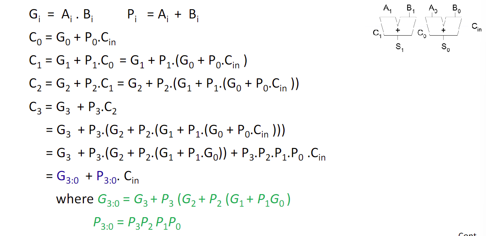

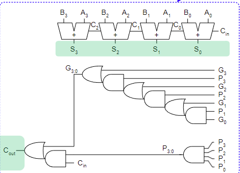

计算延迟
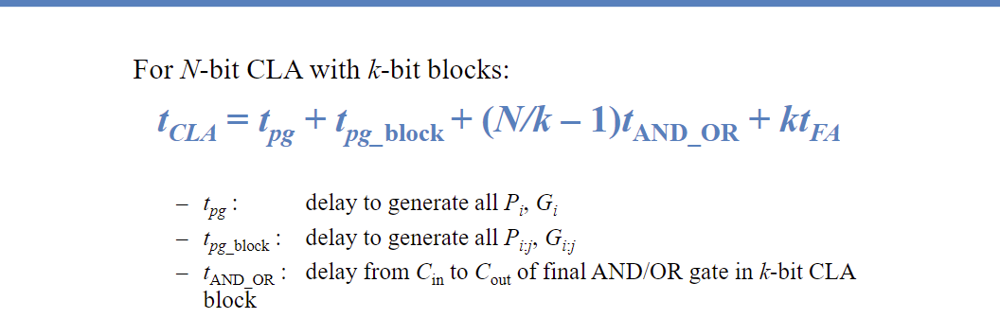

记住4bits的CL加法器各个t的计算方法。tand_or = 2*tFA

### 5.2 比较器

使用异或门和与门

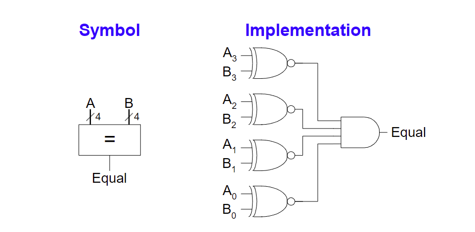
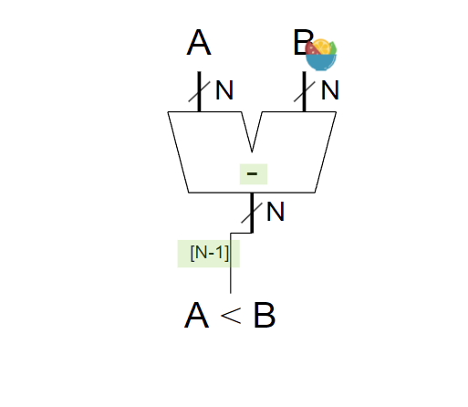

### 5.3 位移器
- 逻辑位移
- 算数位移
- Rotator：轮转，ROR就是把右边的推出再从左边推入；ROL则相反

算数左移N位=X 2 的N次方；算数右移N位=/ 2 的N次方；

### 5.4 算数逻辑单元ALU
### 5.5 Number Systems
用源码表示正数，用补码或反码表示某个正数的负数。

如何表示小数呢？

小数可以分为两种：有限位小数和无限位小数

- 有限位小数：用点来区分整数部分和小数部分
- 浮点数：如何用IEEE格式表示浮点数可以看计组的笔记

### 5.6 计数器
### 5.7 移动寄存器
每个时钟上升沿移动进入一位，出去一位

**带有Load的移动寄存器**
当Load = 1时，就是普通的寄存器；
当Load = 0时，是移动寄存器

### 5.8 Memory Arrays
可以高效的储存大量的数据，有三种类别：
- DRAM
- SRAM
- ROM

**考点：ROM：PROM 可编程的只读存储器**

有多少个式子就有多少位data输出，每条data输出对应一个式子。
把逻辑表达式的真值表写出来，在输出为1的情况下把交点描黑。

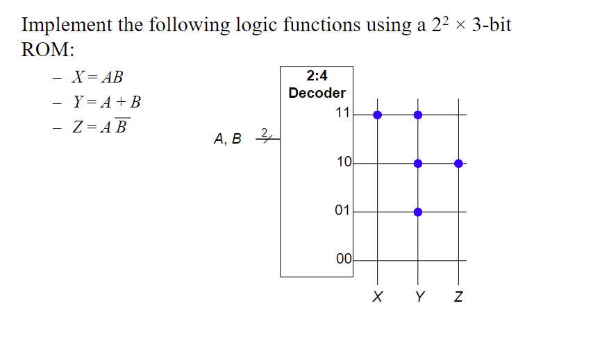

### 5.9 Logic Arrays
- PLAs（可编程的逻辑数组）
    - AND array followed by OR array
    - Combinational logic only
    - Fixed internal connections

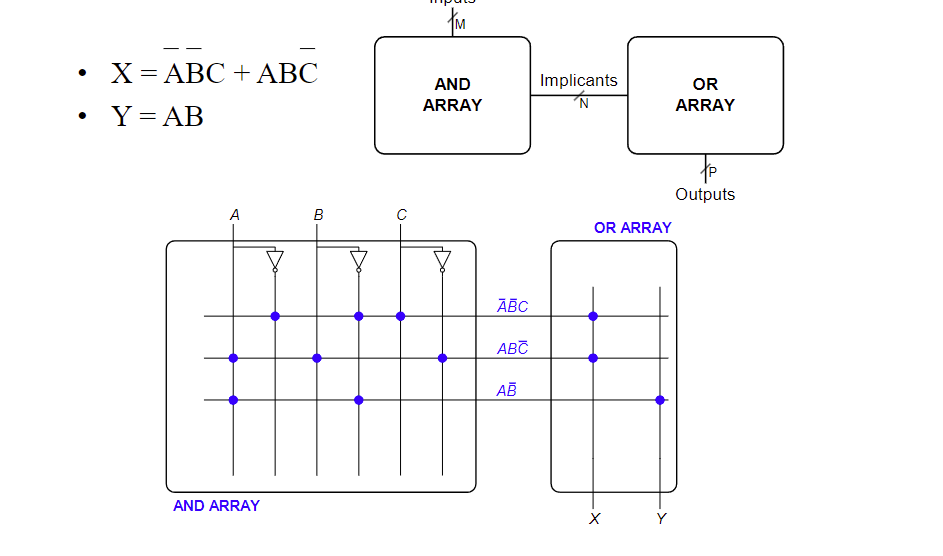
画法很简单，看图即可

- FPGA Field programmable gate arrays
    - Array of Logic Elements (LEs)
    - Combinational and sequential logic
    - Programmable internal connections

由LEs（perform logic）、IOEs（Input/Output elements，外界接口）和Programmable interconnection（连接LEs和IOEs）