# Machine Learning
基本要素：

* Data：输入,不同的应用有不同的数据
* Model：类似于函数
* Loss Function：抽象的本质的模型

约等于Looking for a Function

steps：
1. 定义函数集
2. 给函数评分（Goodness）
3. 选择最好的函数

* 对于预测y有一个function：y=f（x） --》 数据
* Ld(W) = l(yi', yi)的全数据之和   --》 模型

## Data数据集
`D = {(xi, yi)}n i=1`

x是输入，使用列向量表示；

y是输出；

n是数据的个数

## 损失函数Loss function
对值的预测：

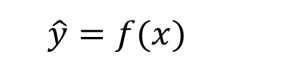
损失函数定义：数据集中的所有数据值的预测值和真实值之间的差值的求和

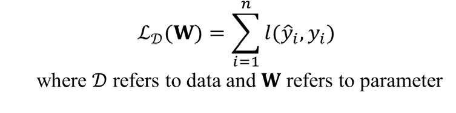
## Supervised Learning 监督学习
使用labeled training data来训练模型，模型的目标是预测新的数据的输出值。监督学习的特征是训练数据是带有标签的数据。

## Unsupervised Learning 无监督学习
Learning the inner connection between different training samples , but without specific labels/
* 模型通过比较得到数据集隐藏的结构
* K-means clustering

## Reinforcement Learning 强化学习
强化学习包括下面几个部分： 
* Agent：智能体，决策者
* Environment：环境，智能体所处的环境
* Action：智能体在环境中的行为
* Reward：智能体在环境中的行为的反馈
* State：智能体在环境中的状态
# 1 Linear Regression and Gradient Descent线性回归与梯度下降
Challenges in Learning: Uncertainty and Unlinear
线性回归是一种线性模型，通过线性回归模型可以预测连续值的输出。线性回归模型的目标是找到一条直线，使得数据集中的所有数据点到直线的距离之和最小。线性回归模型的损失函数是均方误差，均方误差是预测值和真实值之间的差值的平方的求和。

两种损失函数：
absolute loss function：L(y', y) = |y' - y|
squared loss function：L(y', y) = (y' - y)^2 / 2
Total loss function：

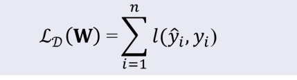
## Regression
Find the best f by solvig the following optimization problem:

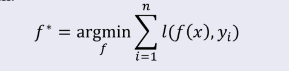
即找到一个函数f使得total loss function最小

这个f如何定义呢？

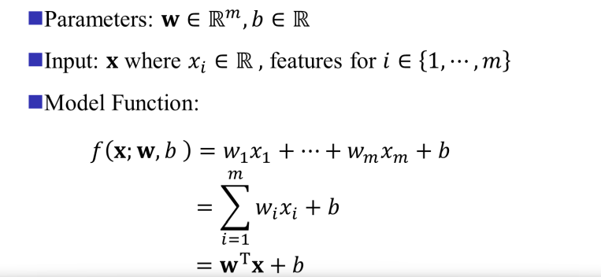
找到合适的W向量和b值使得total loss function最小
根据这个f可以将total loss function转化为：

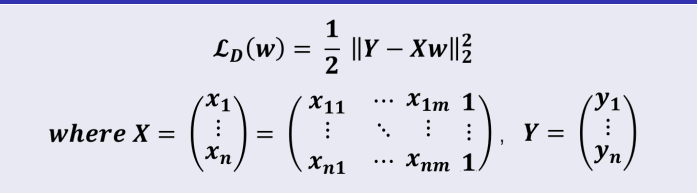

那么如何找到这个W和b呢？

## Closed-form Solution

闭式解也称为解析解

solution:

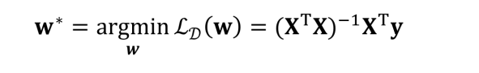
## Regularized Least Squares Regression

𝜆 is called trade-off parameter or regularization parameter

得到的solution：
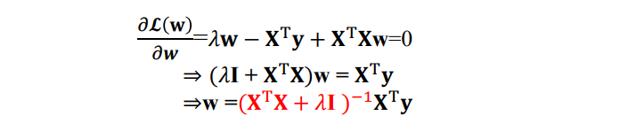

## Gradient Descent 随机梯度下降

原理：通过不断在损失函数递减的方向上更新参数来降低误差，由于每次更新w参数需要在全部数据集上更新计算，性能低。

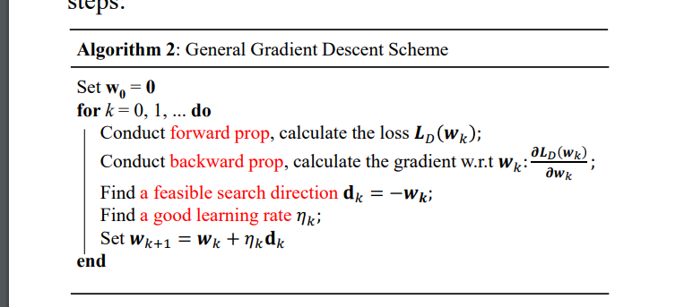

由此出现随机梯度算法：

### 随机梯度算法

每次更新只选取一小部分数据集来更新w

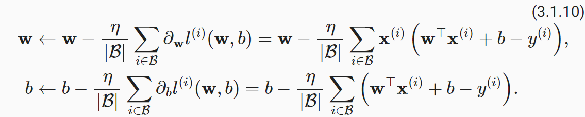

n表示学习率

# 2 Linear Classifcation and Stochastic Gradient Descent  线性分类、支持向量机、随机梯度算法

## Binary Classification 二元分类
（二元分类）是机器学习中的一种基本任务。它指的是将数据分为两个类别之一，例如“是/否”、“成功/失败”或“正类/负类”。

## support vector machine 支持向量机

#### 超平面和间隔

一个超平面由法向量W和截距b决定，其方程为$X^TW + b = 0$。

**什么是 good decision boundary？**
一个好的决策边界是在分类问题中能够有效区分不同类别的数据点，并对未见数据具有良好泛化能力的边界。

Maximum margin solution（最大化间隔解）是一种在分类任务中追求分类器稳健性的策略，尤其常见于支持向量机（SVM）中。选择两个平行的超平面，使其距离间隔经可能大。

二元分类的目标函数f，选择两条平行的线，使得两条线之间的距离最大，这两条线就是支持向量机的决策边界。同时这两条平行线仍然需要满足能够区分数据集中的正类和负类数据点。这两条线的距离就称为margin（间隔）。

**SVM-sketch Derivation**

在支持向量机中，分类器的目标是找到一个决策边界（超平面 y = wx + b）, 支持向量是离超平面最近的点，这些点决定了分类边界的位置。

已知归一化后的正负类支持向量平面，求解两平面之间的距离，即margin。

$d_{margin} = 2 / ||w||$

**SVM 是对margin的最大化**
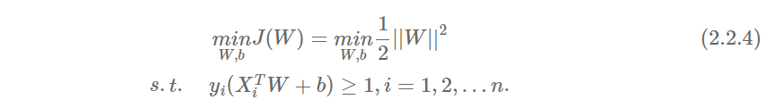

**Relaxed Formulation 松弛形式**
Relaxed Formulation（松弛形式）通常指在支持向量机（SVM）或其他优化问题中，为了处理数据非线性可分的情况，对原始的硬性约束（Hard Margin Constraints）进行放松，从而提出的改进版本。

在 SVM 中，这种松弛形式被称为**软                                                    **支持向量机（Soft Margin SVM）。

引入松弛模型后，目标函数变为：

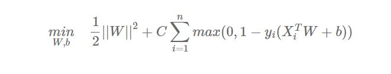

C>0被称为惩罚参数，C越小时对误分类参数惩罚越小，反之越大。

引入松弛变量$ξi$ >=0，则目标函数又可变为：

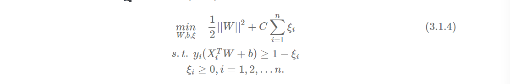

## Gradient Descent 梯度下降
梯度下降是一种优化算法，用于寻找函数的最小值。在机器学习中，梯度下降被广泛应用于训练模型，例如线性回归、逻辑回归和神经网络。

**Gradient Descent Algorithm**

## stochastic gradient descent 随机梯度下降
随机梯度下降是梯度下降的一种变体。与梯度下降不同，随机梯度下降在每次迭代中只使用一个样本来计算梯度。这使得随机梯度下降在处理大规模数据集时更加高效。

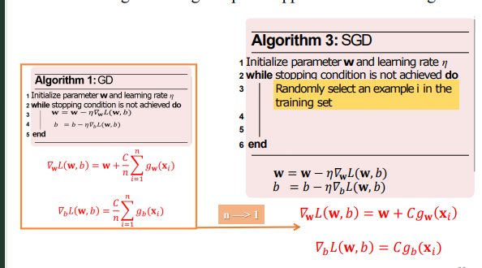

**Minibatch Stochastic Gradient Descent**

Mini-Batch Stochastic Gradient Descent (Mini-Batch SGD) 是 随机梯度下降（SGD） 的一种改进版本，它结合了 批量梯度下降（Batch Gradient Descent） 和 随机梯度下降（SGD） 的优点。与传统的 SGD 每次仅使用一个样本来更新模型参数不同，Mini-Batch SGD 使用小批量数据（mini-batch）来进行更新。

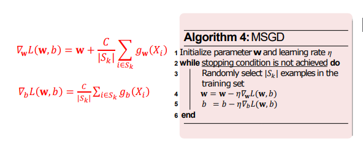
# 3 Logistic Regression and Ensemble Methods 逻辑回归与集成学习算法

在学习逻辑回归之前，先来了解机器学习的原则目标： Prediction 预测与Making Decisions 决策

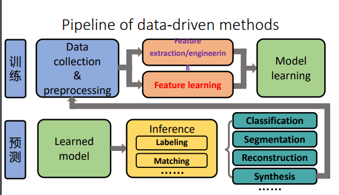

## Logistic Regression 逻辑回归

逻辑回归（Logistic Regression） 是一种常见的分类算法，尽管它的名字中包含“回归”，但它实际上用于分类问题，尤其是二分类问题。它基于统计学和概率论的原理，通过将输入特征映射到一个概率值来预测类别。

**逻辑回归（Logistic Regression）** 是一种常见的分类算法，尽管它的名字中包含“回归”，但它实际上用于**分类问题**，尤其是**二分类问题**。它基于统计学和概率论的原理，通过将输入特征映射到一个概率值来预测类别。以下是对逻辑回归的详细讲解：

---

### 1. **逻辑回归的基本原理**

逻辑回归试图找到一个最佳的决策边界，用于将输入数据分为两个类别（例如，正类和负类）。它的目标是计算给定输入特征x时，属于某一类别（通常是类别 1）的概率。所以逻辑回归算法的输出值永远在0到1之间。

#### 假设
- 假设我们有一个输入向量x = [x_1, x_2, ..., x_n]，这是我们的特征向量。
- y 是目标变量，通常为二元标签，表示类别：( y in {0, 1} )。

#### 逻辑回归模型
逻辑回归的模型基于线性回归模型的输出，但通过一个**sigmoid函数（logistic函数）**进行转换，以确保输出值在 0 和 1 之间，可以解释为概率。

模型的形式为：
$$
[
p(y = 1 | x) = sigma(w^T x + b)
]
$$

其中：
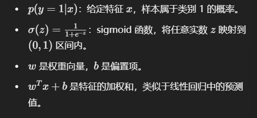

#### 目标
- 通过训练学习参数w和b，使得模型能够尽可能准确地预测样本属于类别 1 的概率。

---

### 2. **损失函数与优化**

逻辑回归通过最小化**对数似然函数（log-likelihood）**来估计参数 \( w \) 和 \( b \)。对于二分类问题，损失函数通常采用**交叉熵损失（cross-entropy loss）**，其公式为：

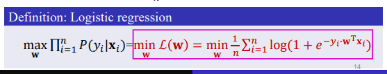

损失函数的目标是最小化交叉熵损失，意味着我们尽可能将预测概率p和真实标签y对应的概率接近。

#### 优化方法
- **梯度下降**：通常使用梯度下降算法来优化参数 \( w \) 和 \( b \)。
- **梯度计算**：
  \[
  \frac{\partial J(w, b)}{\partial w} = \frac{1}{m} \sum_{i=1}^{m} (p^{(i)} - y^{(i)}) x^{(i)}
  \]
  \[
  \frac{\partial J(w, b)}{\partial b} = \frac{1}{m} \sum_{i=1}^{m} (p^{(i)} - y^{(i)})
  \]
  然后根据这些梯度更新参数 \( w \) 和 \( b \)。

---

### 3. **模型评估与决策边界**

逻辑回归输出的是类别 1 的概率，通常情况下，我们根据某个阈值（例如 0.5）将其转换为具体的类别预测：
- 如果 \( p(y = 1 | x) > 0.5 \)，则预测为类别 1。
- 如果 \( p(y = 1 | x) < 0.5 \)，则预测为类别 0。

#### 决策边界
逻辑回归的决策边界是一个超平面（线性边界），可以通过求解：
\[
w^T x + b = 0
\]
来得到。这个边界将数据空间划分为两个区域，预测值大于 0.5 的区域为类别 1，反之为类别 0。

---

### 4. **正则化**

为了防止过拟合，逻辑回归通常采用**正则化**方法，特别是 L2 正则化（也叫 Ridge 正则化）。通过在损失函数中加入正则化项，可以限制模型的复杂度，避免过度拟合训练数据。

带正则化的损失函数为：
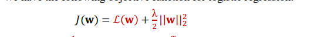

Logistic Loss:

正则化的目标是平衡模型的复杂度和训练数据的拟合程度，防止过拟合。

### 总结
逻辑回归是一种简单、有效的分类方法，广泛应用于二分类和多分类问题。通过最大化对数似然函数，它能够估计出给定特征时属于某一类别的概率。理解其背后的原理和优化方法有助于在实际应用中有效地使用该模型，同时结合正则化可以避免过拟合，提高泛化能力。

如果你有其他问题或需要更具体的代码示例，可以进一步提问！

## 多类别分类问题的定义
* one vs rest method

* one vs one method

* DDAG决策有向无环图
根二叉有向无环图（Rooted Binary Directed Acyclic Graph，简称Rooted Binary DAG）是一种特殊类型的有向无环图（DAG），具有以下特点：

根节点（Root Node）：图中有一个唯一的根节点，所有其他节点都可以通过有向路径从根节点到达。

二叉性质（Binary Property）：每个节点最多有两个子节点。

有向无环（Directed Acyclic）：图中的边是有方向的，并且不存在从某个节点出发经过若干条边又回到该节点的路径，即图中没有环。

这种结构常用于表示决策树、二叉堆等数据结构。

预测过程：
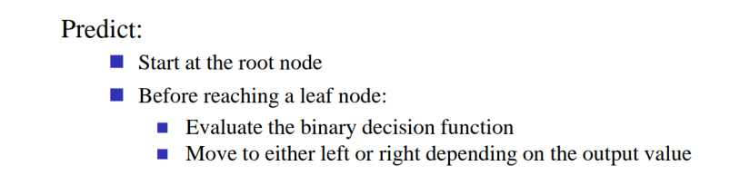

* K-means algorithm K均值算法
K均值算法（K-means algorithm）是一种常用的聚类算法，用于将数据集分成K个簇。其处理过程如下：

初始化：随机选择K个初始质心（Centroids）。

分配簇：对于数据集中的每个数据点，计算其到每个质心的距离。
将每个数据点分配到距离其最近的质心所对应的簇。

更新质心：计算每个簇中所有数据点的平均值，并将该平均值作为新的质心。

重复：重复步骤2和步骤3，直到质心不再发生变化或达到预设的迭代次数。

结果：最终得到K个簇，每个簇由距离其质心最近的数据点组成。

# 4 Overfitting, Underfitting, Regularization and Cross-Validation 过拟合、欠拟合、正则化和交叉验证

<<<<<<< Updated upstream:机器学习/机器学习.md
先回顾一下机器学习模型训练的过程:
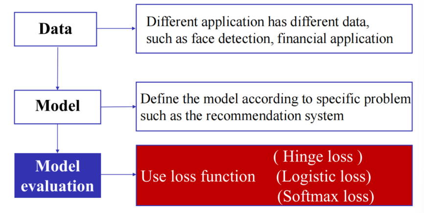
判断model的质量需要使用loss function，loss function的值越小，model的质量越好。

loss function 有三种类型：
* Hinge Loss: 
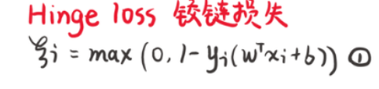
* Logistic Loss:
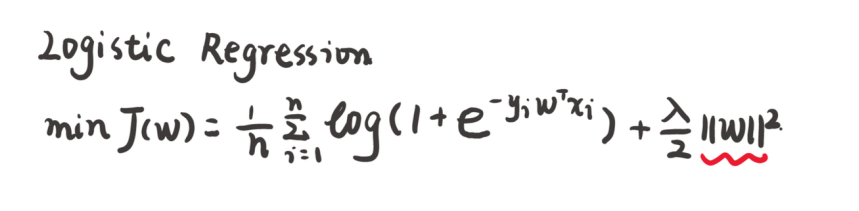
* soft-max loss:
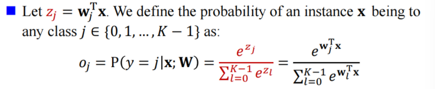

知道这几种loss函数的定义，那我们又该如何使用这些loss函数来判断model的质量呢？我们可以使用中学时期学到的最小方差损失判定，但是很多时候模型并不是线性的，所以我们需要使用交叉验证的方法来判断模型的质量。

首先介绍两种集： 训练集和测试集

* 训练集：用于拟合模型的数据（70%）
* 测试集：用于评估模型的泛化能力（30%）

在训练集中又被分隔出一块：交叉验证集。为什么需要交叉验证集validation set呢

* Business Reason： 
  * Need to choose the beat model
  * measure accuracy（准确性）/power of the selected model
  * better to measure ROI of the modeling project
* Statistical Reason：
  * model building techniques are inherently designed to minimize loss or bias
  * to an extent, a model will always fit "noise" as well as signal
  * if you just fit a bunch of models on a givne dataset and choose the "best" one , it will likely be overly optimistic

### 过拟合与欠拟合
UnderFitting：模型无法捕捉到数据的底层趋势

OverFitting：模型完美拟合数据，但是也把噪音纳入进来，导致表现形式很繁琐

### 偏差-方差权衡 Bias-Variance Tradeoff
对于复杂的模型，可以忽略这个模型再未来数据的准确性。
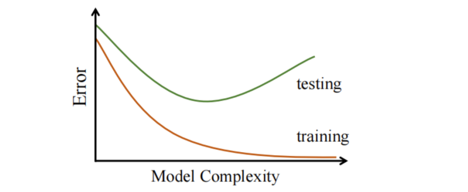

### 交叉验证
使用validation set以调优高维参数，然后仅使用test set来评估模型的泛化能力。

如果我们想减少数据的可变性：
* 使用不同分区进行多轮交叉验证
* 对所有轮次的结果进行平均

# 5 非线性机器学习与集成方法
## 决策树
定义：树的分支代表一个可能的决策、结果或者反应，现实表现为父节点的属性值。中间节点表示某种属性，叶子节点表示最终结果。
那么如何划分决策才是最优的呢？有个评判标准：对于一个value，可以得到全为正的实例，而其余的value，可以得到全为负的实例。如果划分后的每一片叶子的区分度都足够大，说明划分方式好。Entropy熵就是用于表明区分度的。

必考：如何求解数据集合D的熵  呢？
口诀：负数、比例p、Alog2A

假设叶子节点内部有9个正数节点和5个负数节点，可以根据口诀退出熵计算公式：

`entropy(P) = - p+log2p+ - p-log2p-`

当然叶子节点内部也不一定只有正负两个类别，我们假设有c个类别，那么熵的计算公式为：

`entropy(D) = - sum(pclog2pc)`

下面再来介绍Gain，Gain用于表示对于某属性A，其分类可以获得的熵信息增益
`Gain(D, A) = Entropy(D) - sum(* Entropy(Dv))`

* v属于属性A可以取到的所有可能值的集合
* Dv是D的子集，表示A的值为v

### 示范：把类似打网球的表格转化为决策树
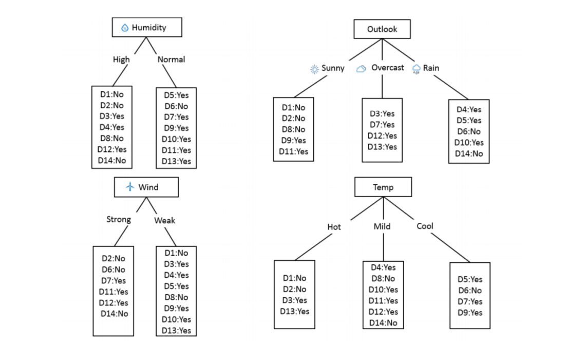
思路：
1. 四颗树木（可能的决策树）套公式计算信息密度，发现Outlook的Gain值最大
2. Overcast的中间节点没必要拆分（因为叶子节点的值全为正的），只需要拆分sunny和rain对应
3. 对于sunny节点，我们可以使用humidity、wind、temp、继续拆分。
4. 对于Rain节点，同样使用humidity、wind、temp、继续拆分、wind拆分效果最好
* 低偏差：模型在训练集拟合得好
* 高方差：模型更有可能做出错误的决策

# 5 Multiclass Classification and Cross-entropy Loss 多类分类和交叉熵损失函数
# 6 Neural Networks and Deep Learning 神经网络与深度学习
# 7 RNN、Transformer、BERT
>>>>>>> Stashed changes:机器学习.md

## 集成学习
将一系列基础模型合并到一起，从而产生一个更好的预测模型。主要方法：Bagging、Boosting

### Bagging
* 通过bootstrap sampling（重采样）得到T个数据集
* 训练T个base learners 通过子数据集

有两种得到结果的方法：
* Majority Voting：对于分类问题，选择T个模型中出现最多次数的结果
* Average：对于回归问题，选择T个模型的平均值

随机森林是Bagging的一种实现，它是一种集成学习方法，通过训练多个决策树来提高预测性能。随机森林的基本原理是通过随机选择特征和样本来构建多个决策树，并将这些决策树的预测结果进行平均或投票来得到最终的预测结果。

## AdaBoost（Adaptive Boosting）
原理：通过训练一系列弱分类器（weak learners），每个弱分类器都在前一个分类器的错误上进行学习，最终将这些弱分类器组合成一个强分类器（strong learner）。

进行Time次循环的时候，每次选择在当前权重下，错误率最小的弱分类机。

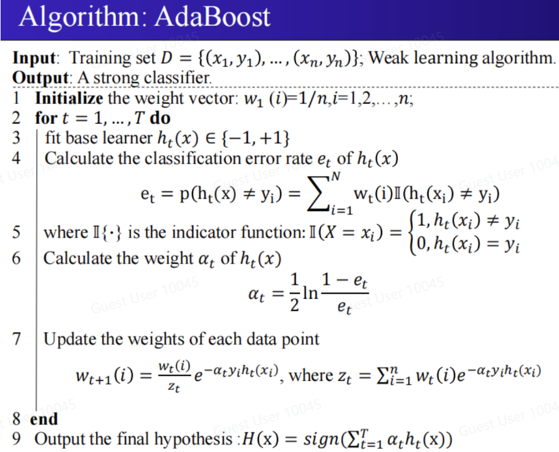

# 6 无监督学习：聚类学习
无监督学习的数据集是没有目标值的。
## 重点：K-Means聚类
* 过程：
1. 随机选取K个点作为初始质心（centroid）
2. 将每个点分配到最近的质心
3. 更新质心
4. 重复2和3直到质心不再变化或者数据点分配情况基本不变

## 层次聚合聚类 Hierarchical Agglomerative Clustering
层次聚合聚类（Hierarchical Agglomerative Clustering，HAC）是一种无监督学习算法，用于将数据点分层次地聚类。HAC的基本思想是通过不断合并最相似的簇来构建一个层次结构，直到所有数据点都被合并到一个簇中。以下是HAC的详细过程：

1. **初始化**：将每个数据点视为一个单独的簇。
2. **计算距离**：计算所有簇之间的距离。常用的距离度量方法包括欧氏距离、曼哈顿距离等。
3. **合并簇**：找到距离最近的两个簇，并将它们合并成一个新的簇。
4. **更新距离矩阵**：更新距离矩阵，重新计算新簇与其他簇之间的距离。常用的更新方法包括最小距离（单链接）、最大距离（全链接）、平均距离和质心距离等。
5. **重复步骤3和4**：重复合并和更新距离矩阵的过程，直到所有数据点都被合并到一个簇中，或者达到预定的簇数量。

HAC的结果通常用树状图（dendrogram）表示，树状图展示了数据点的合并过程和层次结构。通过剪切树状图，可以得到不同数量的簇。

HAC的优点是能够发现数据的层次结构，不需要预先指定簇的数量。缺点是计算复杂度较高，适用于小规模数据集。

* 与K-means算法的比较：
  * 不是参数依赖的，而是实例依赖性
  * 可以生成任意形状的聚类
  * 生成层级的聚类，聚类不只是“在平面切分的”
  * 不需要在聚类之前指定聚类的数量，也不是随机的

# 7 Neural Networks and Deep Learning 神经网络与深度学习
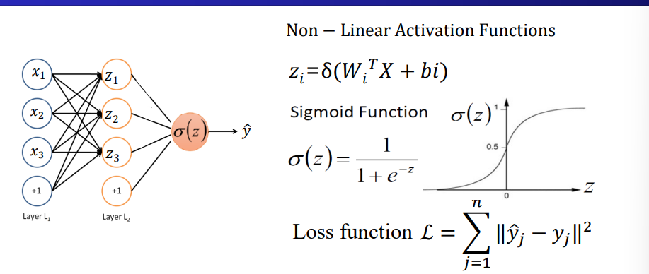
使用权重w对x进行线性变换后带入激活函数得到结果，重复多次的过程是神经网络的基本原理。

## 前向传播
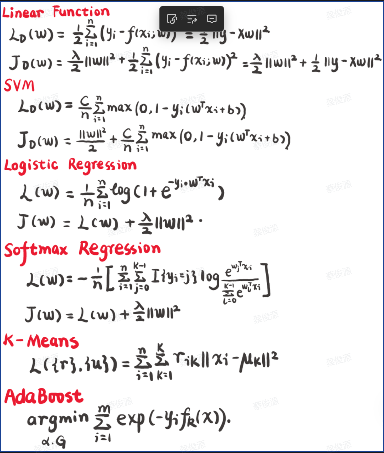

## 反向传播

## CNN 卷积神经网络

*卷积神经网络*（convolutional neural networks，CNN）是机器学习利用自然图像中一些已知结构的创造性方法。卷积神经网络是将*空间不变性*（spatial invariance）的这一概念系统化，从而基于这个模型使用较少的参数来学习有用的表示。

1. *平移不变性*（translation invariance）：不管检测对象出现在图像中的哪个位置，神经网络的前面几层应该对相同的图像区域具有相似的反应，即为“平移不变性”。
2. *局部性*（locality）：神经网络的前面几层应该只探索输入图像中的局部区域，而不过度在意图像中相隔较远区域的关系，这就是“局部性”原则。最终，可以聚合这些局部特征，以在整个图像级别进行预测。

### 图像卷积操作

卷积层所表达的运算实际是互相关运算（cross-correlation），而不是卷积运算。输入张量和核张量通过互相关运算产生输出张量。

已知输入张量为nhXnw，卷积核为khXkw，得到输出张量的规格：

$(n_h - k_h + 1)*(n_w-k_w+1)$

实例：

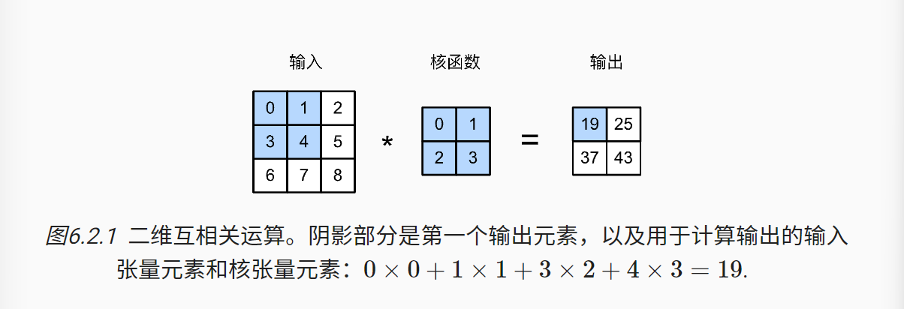

* Stride：卷积核移动的步长
* Padding：在输入数据周围填充额外的数据

# 8 RNN、Transformer、BERT

## 强化学习
三个阶段：监督训练、奖励模型训练、强化学习模型训练

* 监督训练：从数据集中采样问题、根据采样问题，人工给出高质量回答、基于问题和回答，对gpt进行监督训练

* 奖励模型训练：从数据集采样问题并输入第一阶段训练的gpt模型，根据问题和回答，使用奖励模型给出奖励，基于问题和回答，对gpt进行奖励训练

* 强化学习模型训练：从数据集采样问题并输入第一阶段训练的gpt模型，根据问题和回答，使用强化学习模型给出奖励，基于问题和回答，对gpt进行强化学习训练