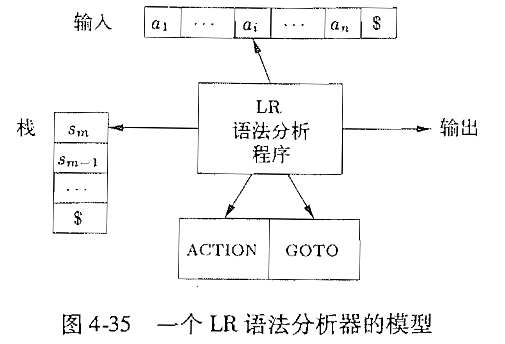

## 1 Right sentential form
最右句型，最右推导产生的句型称为最右句型，最右句型中，句柄的右边一定是终结符
## 2 Handle
**reduction归约：把一个与某产生式的右部相匹配的子串替换成产生式头部的非终结符的过程**

**handle句柄：和某个产生式体匹配的子串，对它归约体现了相应的最右推导**，但不是所有的和产生式体匹配的子串都是句柄，必须对他归约体现最右推导才行。
## 3 Viable prefix
可以出现在一个移入-归约 语法分析器的栈中的最右句型前缀被称为可行前缀。定义：可行前缀是一个最右句型的前缀，并且没有越过最右句型的最右句柄的右端，所以可以通过向可行前缀的右边添加某些终止符得到最右句型。
## 4 items and states
state表明我们在语法分析的过程中所处的位置，state是item的集合。增广文法，为了把开始symbol也加入分析过程而设计的文法，G的增广文法G‘就是在G中加上新开始符号S'和产生式S’->S而得到的文法。

项集的闭包CLOSURE（I）的求法：
1. 把I中的各项加入到CLOSURE（I）中
2. 如果A->a·Bb在CLOSURE（I）中，B->y是产生式，并且B->·y不属于闭包中，则添加，一直重复这个过程

GOTO（I，X），I是项集，X是文法符号，移动项集中的产生式的点，如果右边是X，移动到X的后面。并将产生变化是项集中成新的项集I'

Dfa of LR（0）items的求法；
1. 求I0的闭包，I0初始化为增广文法，闭包作为新的I0；
2. 确定I0的GOTO，移动·形成新的项集，求项集的闭包作为新的Ii，Ij；
3. 重复步骤二知道没有新的状态产生已经状态之间的GOTO关系全部阐明

## 5 shift/reduce（LR）parsing
移入归约分析，设立一个栈用来保存信息，每一步决定将输入移入或者将栈顶归约，直到得到增广文法符号。
## 6 LR（0）parsing
LR语法分析器

当前输入符号ai和栈顶状态sm，查询ACTION【sm，ai】了解要执行什么动作。如果是移入就把下一个状态s移入，更新输入符号；如果是归约就执行归约动作，先将符号进行归约，然后把栈顶的状态弹出，根据归约后的文法符号查询当前栈顶的GOTO函数，把GOTO函指向的状态推入栈中；如果是接受则结束分析；如果是报错就报错。

**LR语法分析算法，需要parsing table，构建parsing的过程：需要知道所有非终结符的FollowSet**
1. 构造G'的规范LR（0）项集族 {I0，I1，...，In}
2. 根据I构造状态i，确定状态i的语法动作
    1. GOTO（Ii，a）=Ij，且Ii中有·位于a前的项，将ACTION【Ii，a】设为移入Ij
    2. A产生式的体的·位于最后，将FOLLOW（A）中的所有a，设置ACTION【Ii，a】为归约A->a
    3. S’->S·，设置$为scc
 3. 对于非终止符的GOTO，设置GOTO表项
 4. 所有未填的项为error

可以先构造LR自动机，方便计算各个表项
## 7 SLR（1）parsing
