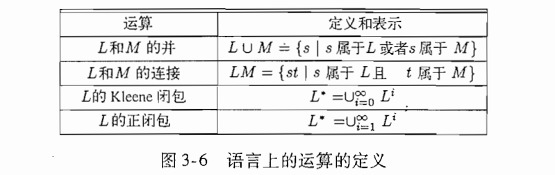
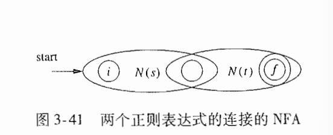
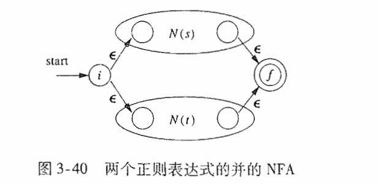
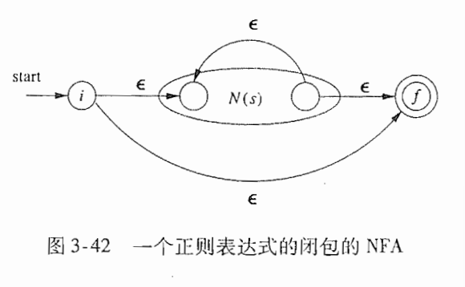
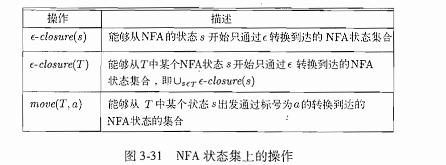
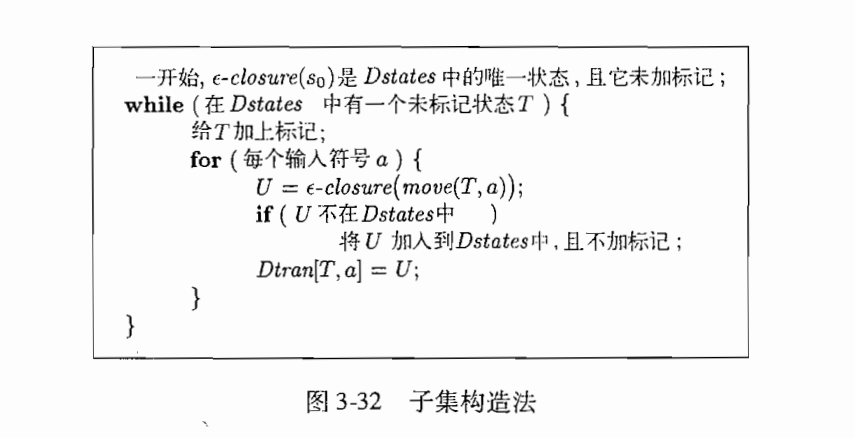

## 1 Write regular express RE 写正规表达式
RE是描述token模式的重要表示方法。

alphabet是一个有限的符号集合，字母、数字、标点符号，符号序列称为串string。空串empty string 是长度为0的string，用e表示

正则表达式的三个运算：连接（concatenation）、或（or）、闭包（kleene）

闭包分为普通闭包和正闭包，正闭包不包含空串，普通闭包是正闭包加上e。string与自身连接称为指数运算，也叫闭包，连接0次是e。或运算时两个string的并集。

正则表达式的构建：正则表达式是由小的基础的正则表达式使用运算规则**递归的**构建起来的。

归纳基础：
- e时一个正则表达式，L（e）={e}，说明该语言只包含空串
- a是字符集里的一个符号，就是一个大小为1的string的正则表达式

构建运算符的优先级：
1. *闭包运算的优先级最高，并且是左结合的
2. 连接其次，也是左结合
3. |优先级最低，左结合

**正则定义**

为给某些正则表达式命名，用符号来调用该正则表达式，使用正则定义实现（regular definition）举例：d->r

d是一个新符号，不在预先规定的字母表中，r是字母表和别的di相并的基础上的正则表达式，任何的r都可以替换成只包含原先定义的字母表中的符号，不包含di，所以di也可以替换成只包含的原先定义的字母表的符号，这个过程就是正则定义的过程。**正则定义可以规定某个string构建的模式。**

## 2 the transition from REs to NFAs 正规表达式转NFA

什么是NFA？先了解什么是fa，fa（finite automata）有穷状态机，fa是recognizer，对输入进行是否的判断；fa分为两类，一类是nfa，一类是dfa。nfa（Nondeterministic finite automata）非确定有限状态机。定义规则如下
- 一个有穷的状态集合S
- 一个输入符号集合M（input alphabet），假设e不在输入集合内
- 一个是Transition function，对特性的上输入和状态做出状态转化的反应
- 一个初始状态S0
- 一个接受状态F

NFA容易通过正则表达式构建，但很难形成程序结构表示。转化需要一张状态转换表，说明每个状态在不同输入下转化的状态。如果一个输入string可以使得S0到达F，说明这个string被NFA接收，否则string被忽略。所有能被接收到集合就是使用正则表达式构建的NFA的描述的string的集合。

下面介绍 **正则表达式re转化为nfa**

给出一个算法，可以把所有的正则表达式转换为NFA。构造一个NFA的规则分为基本规则和归纳规则。基本规则处理不包含运算符的子表达式，归纳规则根据一个给定的表达式的直接**子表达式的NFA**构造这个表达式的NFA。

归纳规则分为三种：连接、或、闭包。

连接

或

闭包

正则表达式的递归构建nfa，先把正则表达式的表达式树写出来，对其进行后序遍历的构造，每个节点根据实际情况分为基本构造和归纳构造，得到的结果就是NFA。
## 3 the transition from NFAs to DFA Nfa转Dfa
什么是DFA？Dfa同样是fa的一种，被称为确定的有限状态机。DFA是NFA的特例，DFA有几个约束条件：
1. 没有e的边
2. 对于一个状态s和每个输入符号a，只有一个标号为a的边离开s，也就是s不能射出两个同样标号的边。但是可以射入两个以上的标号为a的边。

Dfa可以容易的使用程序来表示转化过程

NFA构造DFA算法：子集构造法
算法需要使用NFA为DFA构造一个状态转换表，根据这个转换表可以很容易的实现DFA的程序表示。转换表的是表项的DFA的状态，是NFA的状态集合。算法有三个重要的函数：

注意s是一个nfa状态，T是一个nfa状态集合。

1. 找到NFA的S0的e闭包集合作为DFA的开始状态
2. 对这个开始状态进行对不同输入的move，得到的结果进行e闭包运算，如果这个状态集合还没有归入DFA的状态，归入后重复第二步骤
3. 一直重复知道没有新的DFA的状态出现
4. 包含NFA的结束状态的状态集合是DFA的结束状态
## 4 the transition from FAs to REs 有限状态机转正则表达式 
也就是使用状态机来生成正则表达式
## 5 DFA的最小化
先说明一个概念：Equivalent States

当两个状态都是接收状态或者非接受状态，对于字母表中的每个字母，s和t都有相同的transitions on a to 相同的或者等价的状态，则这两个状态是等价的。

最小化算法；
- 先把DFA状态集合划分会非接受和接收状态集合。
- 使用字母表中的所有字母（所有可能的输入）对subset中的状态集合进行划分成等价的状态集合。
- 重复这个过程直到每个集合只有一个元素或者无法被继续划分

## 6 scanner的构建

**词法分析的错误处理是panic mode**