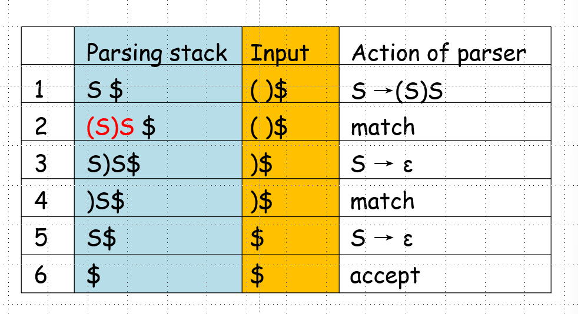

**Top-Down Parsing:**
从开始符号开始，尝试猜测要应用于最终用户程序的产生式。
**Bottom-Up Parsing**
从用户程序开始，尝试反向应用产生式，将程序转换回起始符号
## 1 what is the predictive parsing?
以剩余的输入为基础，猜测哪一个产生式被使用。利用lookahead tokens来预测下一个产生式。

predictive parsing的条件：
- Top-Down Parsing，从文法的开始标记开始
- 可以根据现有的输入token决定一个具体的下一步的产生式，就可以预测
- predictive parsing 接受LL（k）文法
## 2 LL(1) grammar
LL（1）：
- L：从左到右去scan输入
- L：最左推导
- 1：需要最多1个look ahead token来预测

如何判断一个文法是否为LL（1）文法？
- 对于所有的相同左部的产生式当中，产生式的右部的first set不相交
- 对于所有的first set中包含e的非终止符A，first（A）和follow（A）的交集不相交

满足上面两个条件的为LL（1）无关文法

验证LL（1）无关文法时，只用会A=>*e的非终止符才需要求Follow set来验证
## 3 First set and Follow set
非常重要，判断一个文法是不是LL（1）文法的基础！

**First set**：
- define：G=(VN, VT, P, S) is a grammar, b=(VN U VT)* ，FIRST(b) = { a ∊ VT | b => * a......} if b => * ε then ε ∊ FIRST(b)

讲人话就是string b的first set就是可以被b推导的排在第一个终止符的集合

**计算First（A）的算法！！！：**
1. 终止符的first集合是它本身
2. for all A∈ VN ,if A => *ε, then First(A)={ε} else  First(A)={ } ;
3. For each production A→X1…Xj…Xn, First(A)=First(A) U SectionFirst(X1…Xj…Xn);
4. 一直重复3，直到A的first集合没有变化

SectionFirst(X1…Xj…Xn) = (First(X1)-{e})U(First(X2)-{e})U...U(First(Xj+1)) 

Xj+1是第一个不是nullable的symbol，即不能推导到e

- if X1 is not nullable, then SectionFirst(X1…Xj…Xn) =First(X1)
- if X1 is nullable, then SectionFirst(X1…Xj…Xn) =First(X1) -{ε}, and continue to see X2. Stop untill is not nullable .
- if X1…Xn are all nullable, then SectionFirst(X1…Xn)= (First(X1) -{ε}) (First(X2)-{ε})U… U(First(Xn) -{ε}) ∪{ε}

**Follow sets**
- definition：G=(VT, VN, S,P) is a grammar，A∈VN ，FOLLOW(A)={a ∊ VT | S => *…Aa…}，if S => *  …A, then $ ∊ FOLLOW(A)

直观上，非终结符A的跟随集合是该语法的所有句型中A之后的终结符（包括$）的集合。

如何预测，如果当前输入存在于某个产生式右部的first sets中，选择这个产生式，存在于某个产生式左部的非终止符的follow sets中，选择这个产生式

**Follow(A)的算法**
1. S is the start symbol, Follow(S)={$};for all A∊VN, and A≠S,Follow(A)={ };
2. For each production B→αAγ, for each A that is a nonterminal do
   - Follow(A)=Follow(A)U(First(γ) -{ε}) 
   - **if ε ∈ First(γ) then add Follow(B) to Follow(A)**
   - 如果A位于产生式体的最后，add Follow(B) to Follow(A)
3. Repeat 2,until there is no change to any follow set


## 4 Recursive-descent parsing递归下降解析
从一个开始symbol的产生式开始，为每个非终结符 A 定义一个能够识别 A 的procedures，A 语法规则的右侧指定了该过程的代码结构。terminals表示匹配输入，nonterminals表示调用其他的procedures，choices表示alternatives(case or if statement) within the code

递归下降解析的过程：
1. 先判断文法是否属于LL（1）文法
   - 判断是否存在左递归，消除左递归因子
   - 计算First Set和Follow Set
2. 构建Recursive-Descent Parser 
- consists of a main procedure and a group of recursive procedures, each corresponds to a nonterminal of the grammar
- Sub procedures used :
  - match is a procedure that matches the current next token with its parameter, advances the input if it succeeds, and declares error if it does not
  - error is a procedure that prints an error message and exit
- Variable used:
- TOKEN is a variable that keeps the current next token in the input

```
\\If productions of nonterminal U are 
    \\U → x1 | x2 |…|xn, and x1,...,xn≠ ε, then the code for procedure U \\is as follow:
      if TOKEN in First(x1) then p_x1
      else if TOKEN in First(x2) then p_x2
              else …
              …
                   else if TOKEN in First(xn) then p_xn
                       else ERROR

\\If a production of U is U → ε, then rewrite code 
if TOKEN in First(xn) then p_xn
        else if TOKEN not in Follow(U) then ERROR

The code for p_x where x=y1y2…yn is:
    begin p_y1;p_y2;…;p_yn end
    if yi∈VN then p_yi is the call of procedure yi；otherwise, if yi∈VT then p_yi is match(yi)


```
编写main程序，为每个非终结符编写程序，为每个终结符编写match程序，编写error程序
3. 构建一颗语法树
## 5 LL(1)parsing
与递归下降分析中的递归调用函数不同，LL（1）parsing使用一个stack，储存symbols等待match，最终stack和input同时match完，parsing成功。

## 6 Parsing table
描述在适当的解析步骤中产生式的选择。是一个二维数组，M[ N,t ]表示在t输入时选择N的产生式。

如何构建Parsing tables：重复以下两个步骤对每一个非终止符
1. For each token ‘a’ in First(α), add A→ α to the entry M[ A,a ]
2. if ε is in First(α), for each element ‘a’ of Follow(A) (token or $), add A→α  to M[ A,a ]

**The LL(1) parsing algorithm**
parsingalgorithm.png)