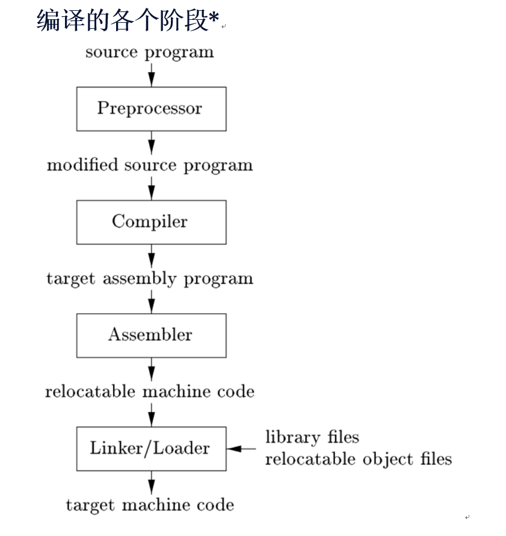

## 1 The Phase Of A Compiler

编译器能够把源程序映射为在语义上等价的目标程序。这个映射过程由两个主要部分构成：**分析部分** + **综合部分**。

一个Compiler的phase大致可以分为：
- lexical analysis（scan）
- syntax analysis（parse）
- semantic analysis 语义分析
- 中间代码生成
- 代码优化
- 代码生成器
- 机器代码优化

### 1.1 lexical analysis
词法分析器读入组成源程序的字符流，并且将它们组成有意义的lexeme的序列，输出token。token = < token-name，attribute-value >。token-name是符号表中的使用的抽象符号，比如标识符的抽象符号就是id，attribute-value对应源字符串在符号表中对应的条目。条目存放该字符串的信息，比如值。词法分析阶段就是把字符流转化为token流。
### 1.2 syntax analysis
语法分析器使用由词法分析器生成的token的第一个元素来构建树形的中间表示，该中间表示给出了token流的语法结构，通常使用语法分析树来表示。树的内部节点表示一个运算
### 1.3 semantic analysis
语义分析器：只用语法树和符号表中的信息来检查源程序是否和语言定义的语义一致。重要的主题是：类型检查，语义检查
### 1.4 中间代码生成
三地址代码 

## 2 compiler和interpreter的区别
- interpreter是直接利用用户提供的输入执行源代码中的指定的操作，把用户的输入映射成输出的过程，并不通过翻译的方法生成目标程序。
- compiler是先将源程序翻译成一种能被计算机执行的形式，完成这个翻译过程的软件称为compiler。