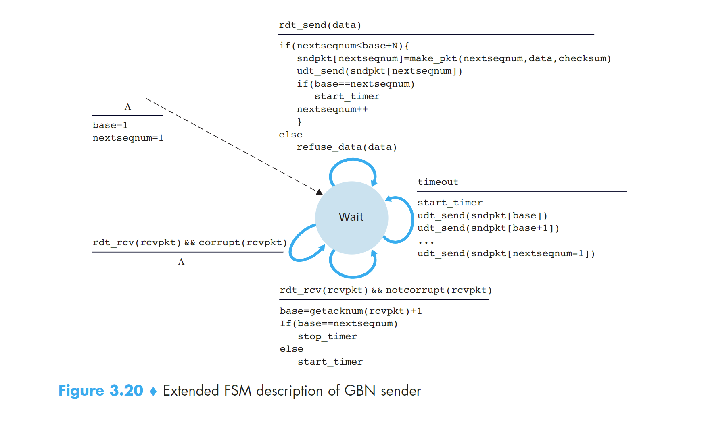

---
title: RDTPrinciples
date: 2024-06-14 21:37:06
tags：计算机网络
---

## 重点：Principles of Reliable Data Transfer

### 1 可靠数据传输服务模型搭建和服务实现
- 提供服务：主机通过应用层在某个进程发送数据到传输层，数据通过可靠的通道channel到达另一个主机的应用层的某个接收进程。
- 服务实现：主机发送进程调用rdt_send()发送数据到传输层，传输层通过可靠的数据传输协议，使用udt_send()发送到链路层，经过不可靠的链路传输到目标主机下的传输层然后调用rdt_rcv()进入传输层，最终进入应用层进程。

**reliable data transfer protocol**

上面提到的可靠的数据传输协议，就是实现上述的服务的过程。比如TCP就是一种可靠的数据传输协议。

### 2 建立一个可靠的数据传输协议

这里我们会循序渐进的介绍几种rdt，每一种都是前一种的完善和升级。

#### 2.1 rdt1.0

发送端和接送端各有一个只有一个状态的FSM，当接收到应用层发送来的数据时，打包成package发送到链路层；接收端从链路层接收到package解包成data发送给上层应用层。

#### 2.2 rdt2.0

rdt1.0是建立在链路层的传输通道不会发生丢包的基础上的，这是不可能的事情，包传递的过程中发生位错误是非常常见的。

rdt2.0是建立在发送的package一定会被接收到但是允许发生bit错误。

- positive acknowledgements：确认收到消息
- negative acknowledgements：未收到请求重发消息

使用这两个信息可以使得sender针对这两个情况进行不同的动作，这是rdt2.0中非常重要的基础。这种可能重传的机制被称为ARQ

ARQ协议需要三个额外的协议来处理位错误的问题：

- Error detection 错误检测
- Receiver feedback 接收端反馈
- Retransmission 重传

接下来正式介绍rdt2.0，首先来看他的FSM，与rdt1.0不同的是，rdt2.0的sender side的FSM有两个状态，receiver side的FSM只有一个状态

先看sender side：两个状态分别为wait for call from above（1） 和 wait for ack or nak（2）。当处于1状态时，当rdt_send(data)消息到来时，执行 `sndpkt = make_pkg(data, checksum); udt_send(sndpkt);` 进入状态2；当处于状态2时，如果收到rdt_rcv(rcvpkt) && isNAK(rcvpkt), 执行`udt_send(sndpkt)`重新发包；如果收到rdt_rcv(rcvpkt) && isACK(rcvpkt), 进入状态（1）

再看receiver side：检查到包损坏，发送NAK；检查到包完好，发送ACK并把package解包的data发送到应用层。

看上去没什么问题，但实际上有个致命的错误！我们无法保证ACK或者NAK的位上没有发生损坏。所以我们仍然需要在包含ACK后NAK的包上添加checksum。如果确认损坏，我们又该如何处理这种情况呢？

解决方法：
在data package 中添加 sequence number 序列号，这样receiver 就可以知道接收的包是不是重发的。

举个例子：stop-and-wait protocol，接收的package的sn之前遇到过则是重发的，不一样或者增加则是新发的

应用这个解决方法，rdt2.1产生了，能够很好的解决ACKNAK消息丢失的问题。

#### 2.2.1 rdt2.1

sender side：

初始状态是wait for call 0 from above，接收到上层发来的data，和0（sn）、checksum一起打包发送给链路层，进入状态wait for ACK or NAK 0。

如果接收到反馈的package，查看发生了损坏或者是NAK package 重发包；如果没有发生损坏或者是ACK 进入下一个状态：wait for call 1 from above。

接收到上层发来的data，和**1**（sn）、checksum一起打包发送给链路层，进入状态wait for ACK or NAK 1。

如果接收到反馈的package，查看发生了损坏或者是NAK package 重发包；如果没有发生损坏或者是ACK 进入下一个状态：wait for call 0 from above。完成闭环。

这个FSM用到的sn码只有0和1。

receiver side：

只有两个状态。

初始状态是wait for 0 from below，接收到链路层发来的包，检查包没有发生错误并且sn是0，解压包把data向上层传递。把ACK消息**和checksum**打包发送给sender side，进入下一个状态 wait for 1 from below；

如果接收到链路层发来的包，检查包发生错误，则把NAK和checksum打包发送给receiver side； 如果接收到链路层发来的包，检查包没错误但是是序号为1的包，把ACK和checksum打包发送给sender side。状态没有发生变化；

状态是wait for 1 from below时，处理流程和上面是完全对称的。 

#### 2.2.2 rdt2.2

rdt2.2，与rdt2.1不同的是：接收端必须包括被ACK消息确认的packet的sequence number，sender必须检查被接收的ACK消息确认的package的sn。也就是说接收端返回的ACK和NAK消息也带有sn序列号，只有符合当前状态的sn才可以做出rdt2.1的反应。也就是处于状态1时收到序号为0的包会发送ACK但不会把data接收而是丢弃了

#### 2.3 rdt3.0
现在要开始考虑链路层的传输会有丢包的情况，这是最可能发生的事情，所以现在的应用大多是rdt3.0的协议。

伴随着这个问题产生的还有两个顾虑：如何检测丢包以及当丢包时需要做出的反应

我们会把检测丢包和恢复重发的任务放在sender side

那么如何检测丢包呢？sender side 在一段固定的时间内没有收到发送的package的ACK，就可以认为这个包丢失了，开始重传。如果发送的package没有丢失，只是在链路层中遭遇了拥塞导致延迟时间超过设定的timeout，也会触发重发，这样就会导致duplicate data packets。幸运的是，可以采用rdt2.2的序号机制来无视多余的重发包。

具体流程可以看FSM

### 3 Pipelined Reliable Data Transfer Protocols

stop-and-wait类型的协议性能无法满足需求，使用流水线rdt协议能提高性能。

流水线模式sender和receiver都可以发送多个packet，不需要等待ACK。为了实现这样的特性采用流水线技术。

实现方法：
1. sequence number的范围可以增长，且每一个在传输的packet都有一个独特的sn。
2. sender和receiver设立buffer用来发送或者接收多个包。sender必须设立buffer来缓存没有ACK的包用来重发。receiver也需要为接收的packet设立buffer来缓存

### 4 Go-Back-N GBN

首先确定一点，GBN协议是一个流水线RDT协议。但是，GBN协议中sender会限制buffer中未ACK的packet的数量为N。

sn的范围分为三部分。一是已经发送且ACK的sn[ 0~base-1]，二是已经发送但是没有ACK的sn[ base~nextseqnum-1]，第三是未发送的待分配的sn[ nextseqnum~n-1]。第二和第三部分之和为N。

N也被称为window size；GBN也被称为sliding-window protocol。window size是可以变化的，比如在tcp协议中，发生congest时会减小。sn码在实际操作中是被封装在section中的，有位数限制。k位的sn码最大为2的k次方-1。tcp的sn码一共32bits

GBN协议的FSM表示如下：

sender在timeout后，会从base开始重新一轮发包；如果某个ACK没收到，那么后面收到的ACK是不会更新base的，所以就会导致发了很多冗余的packet。这是个问题。

### 4 Selective Repeat SR
GBN协议也是存在缺陷的，一个GBN协议包的出错或导致大量的包重发活动。SR协议能够避免不必要的包重发通过让sender只重发那些被发送端认为是出错的丢包的packet。

为解决这个问题，SR升级了sn码的属性，在【base~nextseqnum中允许存在ack的sn并且做上标记】。SR的receiver会承认out-order的packet并且发送ACK，sender也会接收这些ACK。但是receiver的buffer仍然会保留这些被接受的packet直到比他的sn小的miss的packet都被接收到才不保留。

rcv_base取决于期望接收到的packet的sn，也就是被接受且发送ack的下一个sn

SR和GNB的不同在于，所有的接收到packet都会被打上ack，base会跳跃到最小的未被接收到的sn上，可能一跳一大段！但是GBN就不行，他没有处理out-order的packet所以一旦丢包base就会卡住，并且timeout后又从base开始发包一步一步的递增。SR的base是具有跳跃性的！

#### 4.2 TODO：SR的lack
