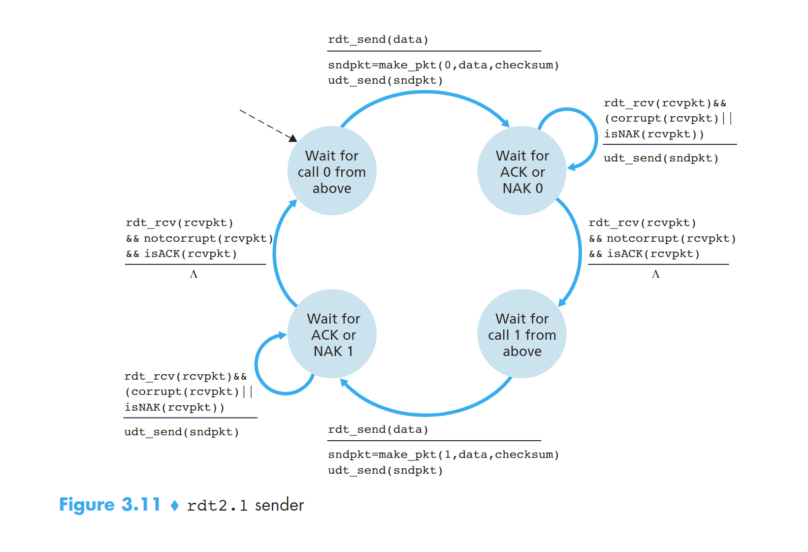
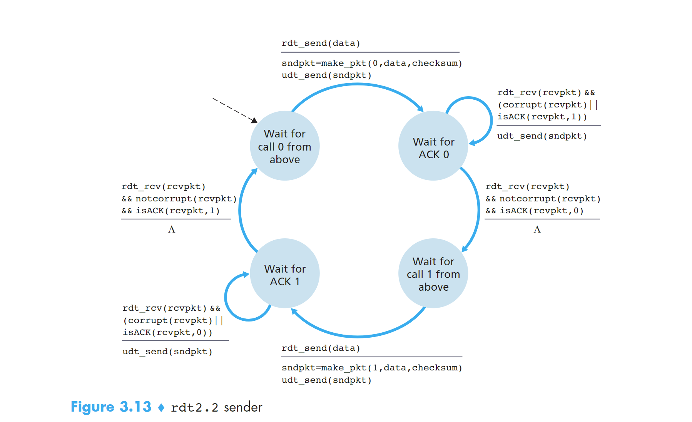
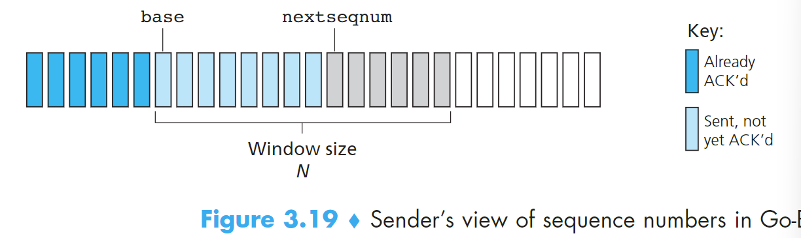
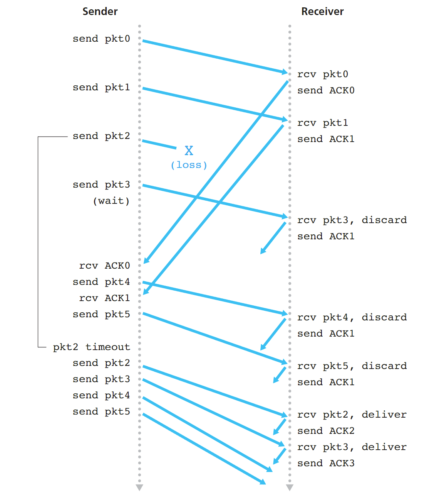
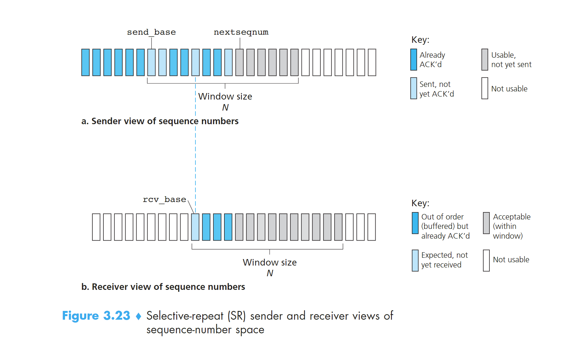
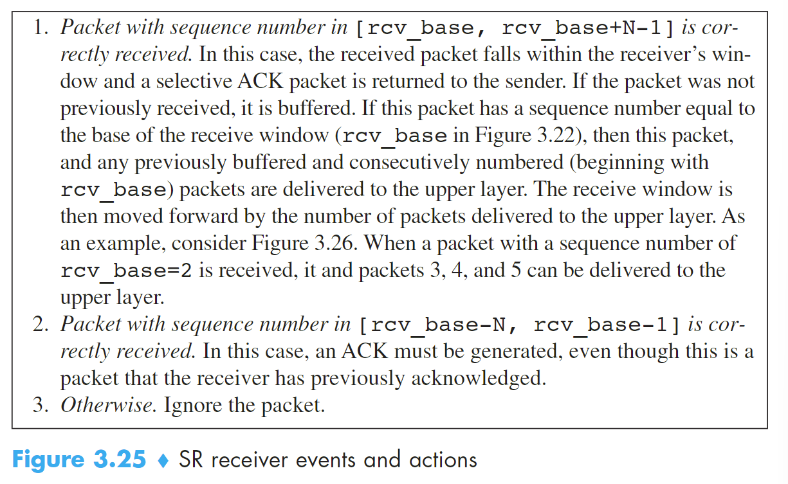

## 重点：Principles of Reliable Data Transfer

### 1 可靠数据传输服务模型搭建和服务实现
- 提供服务：主机通过应用层在某个进程发送数据到传输层，数据通过可靠的通道channel到达另一个主机的应用层的某个接收进程。
- 服务实现：主机发送进程调用rdt_send()发送数据到传输层，传输层通过可靠的数据传输协议，使用udt_send()发送到链路层，经过不可靠的链路传输到目标主机下的传输层然后调用rdt_rcv()进入传输层，最终进入应用层进程。

**reliable data transfer protocol**

上面提到的可靠的数据传输协议，就是实现上述的服务的过程。比如TCP就是一种可靠的数据传输协议。

### 2 建立一个可靠的数据传输协议

这里我们会循序渐进的介绍几种rdt，每一种都是前一种的完善和升级。

#### 2.1 rdt1.0

发送端和接送端各有一个只有一个状态的FSM，当接收到应用层发送来的数据时，打包成package发送到链路层；接收端从链路层接收到package解包成data发送给上层应用层。


#### 2.2 rdt2.0

rdt1.0是建立在链路层的传输通道不会发生丢包的基础上的，这是不可能的事情，包传递的过程中发生位错误是非常常见的。

rdt2.0是建立在发送的package一定会被接收到但是允许发生bit错误。

- positive acknowledgements：确认收到消息
- negative acknowledgements：未收到请求重发消息

使用这两个信息可以使得sender针对这两个情况进行不同的动作，这是rdt2.0中非常重要的基础。这种可能重传的机制被称为ARQ

ARQ协议需要三个额外的协议来处理位错误的问题：

- Error detection 错误检测
- Receiver feedback 接收端反馈
- Retransmission 重传

接下来正式介绍rdt2.0，首先来看他的FSM，与rdt1.0不同的是，rdt2.0的sender side的FSM有两个状态，receiver side的FSM只有一个状态

先看sender side：两个状态分别为wait for call from above（1） 和 wait for ack or nak（2）。当处于1状态时，当rdt_send(data)消息到来时，执行 `sndpkt = make_pkg(data, checksum); udt_send(sndpkt);` 进入状态2；当处于状态2时，如果收到rdt_rcv(rcvpkt) && isNAK(rcvpkt), 执行`udt_send(sndpkt)`重新发包；如果收到rdt_rcv(rcvpkt) && isACK(rcvpkt), 进入状态（1）

再看receiver side：检查到包损坏，发送NAK；检查到包完好，发送ACK并把package解包的data发送到应用层。


看上去没什么问题，但实际上有个致命的错误！我们无法保证ACK或者NAK的位上没有发生损坏。所以我们仍然需要在包含ACK后NAK的包上添加checksum。如果确认损坏，我们又该如何处理这种情况呢？

解决方法：
在data package 中添加 sequence number 序列号，这样receiver 就可以知道接收的包是不是重发的。

举个例子：stop-and-wait protocol，接收的package的sn之前遇到过则是重发的，不一样或者增加则是新发的

应用这个解决方法，rdt2.1产生了，能够很好的解决ACKNAK消息丢失的问题。

#### 2.2.1 rdt2.1

sender side：


初始状态是wait for call 0 from above，接收到上层发来的data，和0（sn）、checksum一起打包发送给链路层，进入状态wait for ACK or NAK 0。

如果接收到反馈的package，查看发生了损坏或者是NAK package 重发包；如果没有发生损坏或者是ACK 进入下一个状态：wait for call 1 from above。

接收到上层发来的data，和**1**（sn）、checksum一起打包发送给链路层，进入状态wait for ACK or NAK 1。

如果接收到反馈的package，查看发生了损坏或者是NAK package 重发包；如果没有发生损坏或者是ACK 进入下一个状态：wait for call 0 from above。完成闭环。

这个FSM用到的sn码只有0和1。

receiver side：


只有两个状态。

初始状态是wait for 0 from below，接收到链路层发来的包，检查包没有发生错误并且sn是0，解压包把data向上层传递。把ACK消息**和checksum**打包发送给sender side，进入下一个状态 wait for 1 from below；

如果接收到链路层发来的包，检查包发生错误，则把NAK和checksum打包发送给receiver side； 如果接收到链路层发来的包，检查包没错误但是是序号为1的包，把ACK和checksum打包发送给sender side。状态没有发生变化；

状态是wait for 1 from below时，处理流程和上面是完全对称的。 

#### 2.2.2 rdt2.2

rdt2.2，与rdt2.1不同的是：接收端必须包括被ACK消息确认的packet的sequence number，sender必须检查被接收的ACK消息确认的package的sn。也就是说接收端返回的ACK和NAK消息也带有sn序列号，只有符合当前状态的sn才可以做出rdt2.1的反应。也就是处于状态1时收到序号为0的包会发送ACK但不会把data接收而是丢弃了




#### 2.3 rdt3.0
现在要开始考虑链路层的传输会有丢包的情况，这是最可能发生的事情，所以现在的应用大多是rdt3.0的协议。

伴随着这个问题产生的还有两个顾虑：如何检测丢包以及当丢包时需要做出的反应

我们会把检测丢包和恢复重发的任务放在sender side

那么如何检测丢包呢？sender side 在一段固定的时间内没有收到发送的package的ACK，就可以认为这个包丢失了，开始重传。如果发送的package没有丢失，只是在链路层中遭遇了拥塞导致延迟时间超过设定的timeout，也会触发重发，这样就会导致duplicate data packets。幸运的是，可以采用rdt2.2的序号机制来无视多余的重发包。

具体流程可以看FSM


### 3 Pipelined Reliable Data Transfer Protocols

stop-and-wait类型的协议性能无法满足需求，使用流水线rdt协议能提高性能。

流水线模式sender和receiver都可以发送多个packet，不需要等待ACK。为了实现这样的特性采用流水线技术。

实现方法：
1. sequence number的范围可以增长，且每一个在传输的packet都有一个独特的sn。
2. sender和receiver设立buffer用来发送或者接收多个包。sender必须设立buffer来缓存没有ACK的包用来重发。receiver也需要为接收的packet设立buffer来缓存

### 4 Go-Back-N GBN

首先确定一点，GBN协议是一个流水线RDT协议。但是，GBN协议中sender会限制buffer中未ACK的packet的数量为N。

sn的范围分为三部分。一是已经发送且ACK的sn[ 0~base-1]，二是已经发送但是没有ACK的sn[ base~nextseqnum-1]，第三是未发送的待分配的sn[ nextseqnum~n-1]。第二和第三部分之和为N。

N也被称为window size；GBN也被称为sliding-window protocol。window size是可以变化的，比如在tcp协议中，发生congest时会减小。sn码在实际操作中是被封装在section中的，有位数限制。k位的sn码最大为2的k次方-1。tcp的sn码一共32bits

GBN协议的FSM表示如下：

sender在timeout后，会从base开始重新一轮发包；如果某个ACK没收到，那么后面收到的ACK是不会更新base的，所以就会导致发了很多冗余的packet。这是个问题。



### 4 Selective Repeat SR
GBN协议也是存在缺陷的，一个GBN协议包的出错或导致大量的包重发活动。SR协议能够避免不必要的包重发通过让sender只重发那些被发送端认为是出错的丢包的packet。

为解决这个问题，SR升级了sn码的属性，在【base~nextseqnum中允许存在ack的sn并且做上标记】。SR的receiver会承认out-order的packet并且发送ACK，sender也会接收这些ACK。但是receiver的buffer仍然会保留这些被接受的packet直到比他的sn小的miss的packet都被接收到才不保留。


rcv_base取决于期望接收到的packet的sn，也就是被接受且发送ack的下一个sn



SR和GNB的不同在于，所有的接收到packet都会被打上ack，base会跳跃到最小的未被接收到的sn上，可能一跳一大段！但是GBN就不行，他没有处理out-order的packet所以一旦丢包base就会卡住，并且timeout后又从base开始发包一步一步的递增。SR的base是具有跳跃性的！

#### 4.2 TODO：SR的lack

## TCP传输协议

### TCP socket
TCP socket 表示使用四元组: {源ip地址、源端口号、目标ip地址、目标端口号}

### TCP Connection

- connect-oriented：面向连接，相互发送预备报文段，以确保数据传输的参数。
- full-duplex service：全双工服务，如果一台主机上的进程A与另一台主机上的进程B存在一条TCP连接，那么应用层的数据就可以在进程B流向进程A的同时，也从进程A流向进程B；
- point-to-point：单个接收方之间的链接
- three-way handshake：三次握手，**客户端先发送一个特殊的TCP报文，服务器用另一个特殊的报文来响应，最后客户再用第三个特殊报文来作为响应。**

客户进程通过使用socket套接字来将要发送的数据写入send buffer，os会把send buffer里的数据包装成ip datagram，在由链路层打包成frame发送出去，目标服务器接受到后逐层拆解后把数据写入TCP receive buffer ，再由Socket来读取数据。

TCP可以从buffer中取出放入的segment中的数据最大的数量限制于MSS（最大报文段长度）,而MSS则由MTU（链路层的最大传输单元）决定。

### TCP segment structure 报文段结构

**重点结构成员：**

- Sequence Number：32bit的序号字段
- Acknowledge Number：32bit的确认号字段
- Receive Windows：16bit的接受窗字段，用于控制流量
- Header Length: 4bit的header长度字段，用于指示以32bit为单位的TCP的头部的长度。
- Option: 动态调节
- 6bit的标志字段（flag field）：
  - ACK：确认字段中的值是否有效；
  - RST、SYN、FIN：用于连接建立和拆除；
  - CWR、ECE：在明确拥塞通过中使用
  - PSH：被置位时，指示接收方立即将数据交给上层；
  - URG：指示segment中存放着被发送端上层实体设置为“紧急”的数据；
- Urgent Data Point: 16bit的紧急数据指针字段，指出紧急数据的最后一个字节；

#### segment number and acknowledgement number

报文段的序号是该报文段首字节（data）的字节流编号，而不是建立在传送的报文段的序列上。

什么是字节流编号呢？

假设现在A主机要发送一串50000字节的data到B主机，但是MSS为1000字节，所以这个数据就需要拆解为50个size为1000字节的segment来多次发送，这50000字节流会被编号，0~49999，所以第一个segment的第一个字节的字节流编号就是0，第二个segment的第一个字节流编号就是1000，依次类推。

**主机A填充进报文段的确认号是主机A希望从主机B接收到的下一个字节的字节流序号！**

**由于网络中TCP的传输是不确定的，所以被拆分成多个TCP的数据不可能按原先的顺序被接收方接收，所以需要segment number在确定子数据包的顺序。**

**但是光有segment number是不够的， 因为在网络中不仅有发送方，还有接收方也会发送，TCP是全双工的。所以需要确认号。这样就能保证双方接收的data都能按照正常的顺序进行排列**


#### 必考重点：RDT可靠的数据传输

先来看一段TCP发送的代码
```C
/* Assume sender is not constrained by TCP flow or congestion control, that data from above is less than MSS in size, and that data transfer is in one direction only. */

NextSeqNum=InitialSeqNumber
SendBase=InitialSeqNumber
    
loop (forever) {
    switch(event)
        
        event: data received from application above
            create TCP segment with sequence number NextSeqNum
            if (timer currently not running)
            	start timer
            pass segment to IP
            NextSeqNum=NextSeqNum+length(data)
            break;
    
        event: timer timeout
            retransmit not-yet-acknowledged segment with smallest sequence number
            start timer
            break;
    
        event: ACK received, with ACK field value of y
            if (y > SendBase) {
                SendBase=y
                if (there are currently any not-yet-acknowledged segments)
                	start timer
            }
    		break;
} /* end of loop forever */

```

设置一个循环监听事件
- 当从上层应用接收到数据时：
1. 创建一个TCP数据段，序列号为 NextSeqNum。
2. 如果定时器未启动，则启动定时器。
3. 将数据段传递给IP层进行发送。
4. 更新 NextSeqNum 为 NextSeqNum + length(data)，表示下一个将要发送的数据段的序列号。
- 当定时器超时时：
1. 重传尚未确认的最小序列号的数据段（最早发送但未被确认的数据段）。
2. 重启定时器。
- 当接收到ACK时：
1. 检查ACK字段的值 y 是否大于 SendBase。
2. 如果 y 大于 SendBase，则更新 SendBase 为 y，表示所有序列号小于 y 的数据段都已经被确认。
3. 如果仍然有未被确认的数据段，则重启定时器。

**超时间隔加倍**

当发生超时事件时，TCP重传时都会将下一次的超时间隔设为先前值的两倍；当发生其他两个事件计时器重启时，TimeoutInterval由最近的EstimatedRTT值与DevRTT值推算得到。这种修改提供了一个形式受限的拥塞控制。

**快速重传**

duplicate ACK：对一个已经发送过的segment进行再次的确认，重发一次ack

当比期望segment number的失序报文段（就是发送的segment number和上一个ACK不一致）到达时，接收方立刻发送冗余ACK（duplicate ACK），指示下一个期望字节的序号。如果TCP发送方接收到对相同数据的**三个**duplicate ACK TCP就执行快速重传，即在报文段的定时器**过期之前**重传丢失的报文段，

**选择确认 selective acknowledgement**

接收端非常容易接收到out-of-order的segments，那还能用当前接收到的最小ack作为sendbase吗

所以就需要选择确认：允许TCP 接收端有选择的确认那些失序的报文段而不是收到什么确认什么，不是积累地确认最后一个正确接收的有序报文。

如何确定当前主机应该发送的ACK的值？

有以下几个原则：

1. 累积原则：ACK如果为n，则表示主机确认接收到0~n-1的序号的segment，所以ACK可以是最小的未确认segment序号；
2. 期望下一个发送：ACK被主机视为希望下一个发送的segment，在一些简单的TCP发送程序，ACK赋值给sendBase，用来确定每次定时器到期时第一个发送的segment；
3. 丢包和延迟：仍然发送上一个ACK，被称为duplicate ACK，发送超过三次触发快速重传。

#### 流量控制 Flow Control

发送端需要维护一个receive window 来控制流量。receive window 用于给发送者一个指示，该接收方还有多少可用的缓存空间。因为TCP是全双工通信（发送端同时也是接收端，接收端同时也是发送端），所以link两端的sender都需要维护一个receive window。

RcvBuffer：接收缓存的总大小
rwnd：可用的接收缓存的大小

#### TCP Connect Management

##### 三次握手连接 three-way handshake


##### 四次握手关闭 four-way handshake


#### TCP State

**客户端TCP经典状态**

客户端应用初始化一个TCP连接，发动SYN

- SYN_SENT： Receive SYN & ACK，send ACK
- ESTABLISHED：Send FIN
Client application initiates close connect
- FIN_WAIT_1：Receive ACK， send nothing
- FIN_WAIT_2：Receive FIN，send ACK
- TIME_WAIT：wait 30 seconds
- CLOSED

**服务端经典状态**

Server application creates a listen socket

- LiSTEN: Receive SYN, send SYN & ACK
- SYN_RCVD: Receive ACK,  send nothing
- ESTABLISHED: Receive FIN, send ACK
- CLOSE_WAIT: Send FIN
- LAST_ACK: Receive ACK, send nothing
- CLOSED

#### 多路复用与多路分解（Multiplexing and Demultiplexing）

运输层的多路复用与多路分解，就是多主机上的进程之间（A主机的进程1与B主机的进程2）的运输服务。一个进程有一个或多个套接字（socket），它相当于从网络向进程传递数据和从进程向网络传递数据的门户。

- Multiplexing：在源主机从不同socket中收集data blocks，并为每个data block 封装首部信息（header）从而生成segment，然后把segment传递到网络层；
- Demultiplexing：在接收端，运输层会检查这些字段，标识处接收socket，进而将segment定向到该socket，即把运输层segment的data交付给正确的socket（进程与网络的门户，也就是设备的端口）

multiplexing要求：
1. socket有唯一的标识符
2. segment的header中有用来指示交付给的socket的特殊字段

这些特殊字段就是源端口号字段和目的端口号字段


#### 必考重点：TCP的拥塞控制 Principles of Congestion Control

##### 拥塞原因和代价

- 当分组的到达速率接近链路容量时，分组经历巨大的排队时延；
- 发送方在遇到大时延时所进行的不必要重传会引起路由器利用其链路带宽来转发不必要的分组副本；
- 当一个分组沿一条路径被丢弃时，每个上游路由器用于转发该分组到丢弃该分组而使用的传输容量最终被浪费掉；

##### 拥塞控制方法

- end-to-end congestion control

TCP segment 丢失意味着 网络拥塞，TCP会减低窗口大小（cwnd、rwnd）。

- network-assisted congestion control

网络层中的路由器会返回关于链路是否发生congest的信息给主机。下面会详细介绍一个网络辅助拥塞控制算法的应用。

#### 重点来叻：TCP拥塞控制 Congestion Control

运行在发送方的TCP拥塞控制机制跟踪一个额外的变量，即congestion window（cwnd）。它规定了一个TCP发送方能向网络中发送流量的最大速率，用来限制主机发送流量，如果主机知道自己和目的地之间存在congest，会降低发送的rate

发送方未确认的数据量不会超过cwnd和rwnd的最小值。

cwnd是动态变化的。

- 一个丢失的报文段表意味着拥塞，因此当丢失报文段时应当降低TCP发送方的速率；
- 一个确认报文段指示该网络正在向接收方交付发送方的报文段，因此，当对先前未确认报文段的确认到达时，能够增加发送方的速率；

##### TCP拥塞控制算法

算法包括三个部分：**slow-start、congestion avoidance、fast recovery**

- slow-start：
在慢启动状态下，cwnd的值以1个MSS开始并且每当传输的segment首次被确认就增加1个MSS。
- 如果存在一个由超时指示的丢包事件，TCP发送方将cwnd设置为1并重新开始慢启动过程。它还将第二状态变量ssthresh（慢启动阈值）设置为cwnd/2
- 一旦进入拥塞避免状态，cwnd的值大约是上次遇到拥塞时的值的一半，即距离拥塞可能并不遥远；在任意状态冗余ACK达到3个就会进入快速恢复状态的缺失报文段。


