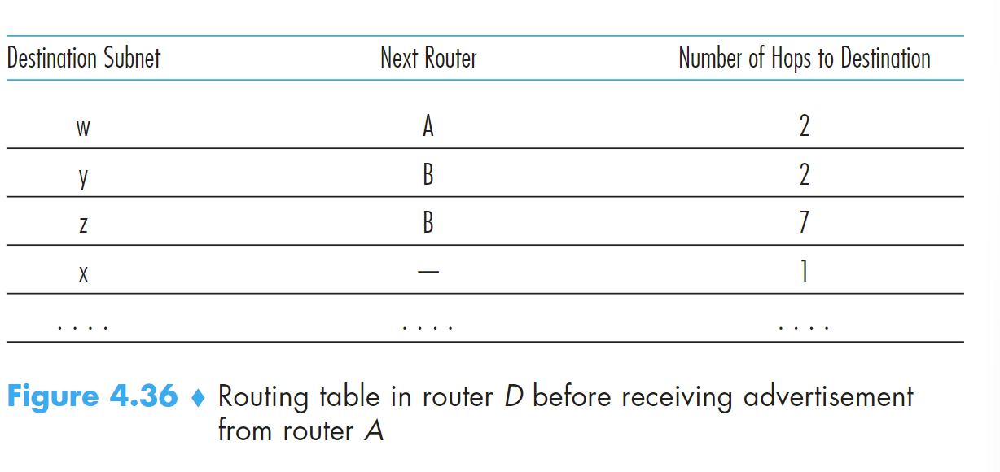
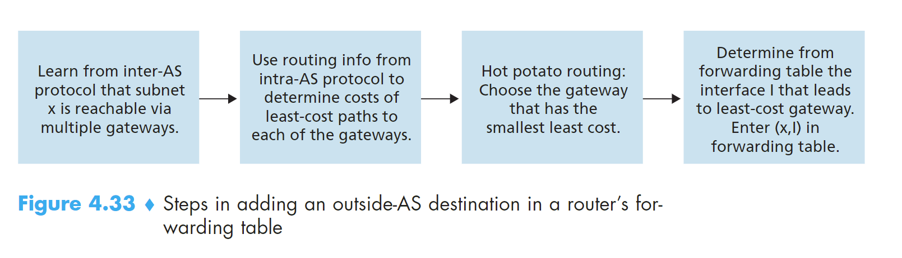

## Hierarchical Routing

### 1 Hot-Potato routing

理念：a router send the packet to the gateway router that has the smallest router-to-gateway cost among all gateways with a path to the destination.

## Routing in the Internet

**autonomous system（AS）：在同一个行政和技术管理下的router集合，在这些routers之间执行相同的routing protocol**

### 1 Intra-AS Routing in the Internet : RIP

在autonomous system里如何routing？

- RIP：routing information protocol
- OSPF：Open Shortest Path First 

#### 1.1 RIP

RIP也是一种DV协议，但在RIP中边架设在路由器以及它的目标subnet之间，边的cost使用**hop**来衡量，hop是从路由器以及它的目标subnet的最短路径上穿过的subnet数。hop值小于15是AS系统使用RIP的限制
和DV一样，RIP也需要定期更新hop矩阵表，RIP使用**RIP response message和RIP advertisement**来更新矩阵表。每一个router有RIP table（routing table）路由表有三列：**destination subnet、the next router along the shortest path（源router下一个跳转的router）、number of hop**。

现在考虑存在hop发生变化的情况，当一个路由器的路由表发生变化，会发出advertisement，收到消息的路由器根据这个advertisement携带的信息对自身的路由表进行修改，默认这个消息的最小消息是正确的。

现在来考虑如何实现RIP协议。如果超过180s没收到来自相邻路由的advertisement会认为这个router不可到达，需要重新修改routing table并发送advertisement。可以使用RIP request message 主动请求信息，这些message使用UDP协议。拿UNIX系统来举例，RIP程序运行在routed进程中，这个进程负责维护routing information 和邻居router的routed进程交换信息，也就是request和advertisement的过程。

重点是修改路由表这一部分！！！

#### 1.2 OSPF
OSPF部署在 upper-tier ISPs，RIP部署在lower-tier ISPs。OSPF是使用link-state信息流和Dijkstra算法的link-state协议。OSPF协议把整个AS系统看成一个图。其中的任何一个router会运行算法得到一个shortest-path tree to 所有的subnets，自己是根节点。OSPF不会强行更改link weight，但使用link weight提供决定最小开销路径的routing。和RIP不同，router传播information到所有的routers in AS,甚至router会定期传播link-state information，哪怕没改变。

OSPF的优点：
- Security：路由器之间交换link information可以要求认证，受信任的路由器才可以参与OSPF协议在AS中。两种认证方式：simple 和 MD5 。simple就是简单的密码认证，MD5是密钥认证。
- Integrated support for unicast and multicast routing
- Support for hierarchy within a single routing domain：构建最短路径树也就是划分了层次！层次化可以带来很多的好处

area border router：负责routing packet outside the area

backnone area：AS中一个OSPF区域被配置为骨干区域。负责在AS中的不同区域route traffic 

#### 1.3 Inter-AS Routing：BGP
Board Gateway Protocol，在AS之间routing

- 持有相邻ASs可达性的信息
- 在AS内部的所有router中传播可达性信息
- 根据可达性信息和AS policy决定 good router

BGP知道internet中的AS中的所有的subnet并且知道怎么到达该地方

**BGP Basic**
BGP在IP层中是非常非常重要的！！！下面会非常详细的介绍BGP协议。这个协议把网络层中所有的事物都glue在一起。不管是AS内部的routers之间还是不同AS的router之间可以建立semipermanent TCP connect。这是BGP的基础。现在遇到我们的第一个概念BGP peers，TCP connect连接的两端的router称为BGP peers。用来传送BGP messages的TCP连接称为BGP session。之前介绍过，TCP连接分内部连接和不同AS之间的外部连接，所以BGP session也分为external BGP session和internal BGP session。BGP协议中，AS可以通过相邻AS了解目的地的可达性。在BGP中，注意目的地不再是host，而是CIDRized prefixes，代表一个subnet或者和subnet的集合。

现在了解了BGP中新出现的概念，我们来接着看BGP如何distribute prefix 可达性信息通过BGP sessions。假如AS3想要传播从AS3出发可达的prefix，把这些prefix打包成BGP message，然后在gate way routers之间建立BGP session 发送给AS1，然后AS1也会发送自己的 prefix给AS3，然后AS1也对自己的邻居AS2发送 。eBGP  session收到别的AS的信息后会使用 iBGP session 向内部路由器进行传播。当一个gate router的信息传送给AS中的另外一个gate router时，又会把这个信息传递出去，这样AS2也知道AS3的信息了。当一个router收到新的prefix时，就会在forwarding table中新建一个entry。

recall：forwarding table 由entry（x,I）x是收到的从什么什么AS可以到达的prefix（subnet） x； I是AS中收到该消息的gateway router的interface（这个interface是对内部的！！！！！！）；

**Path Attributes and BGP Routes**

再来了解一些概念：
- ASN autonomous system number：在BGP中标识该AS的编码，就像接口的IP地址一样。
- route：router广播一个prefix时，会带上表示BGP attribute的number。prefix带上attribute number 就是 route。
- BGP attribute：
  - AS-PATH
传播一个prefix时，经过的AS。一个prefix是从AS2传到AS1的，那么AS1要传播这个prefix时会带上AS-PATH：AS2AS1，这样就能知道这个prefix的传播路径，也可以用来预防looping advertisements
  - NEXT-HOP：AS-PATH的开始的第一个router interface，可以用来计算gateway router选择哪个interface来得到传输到internal router的最小路径的开始，并作为（x，I）中的I存入该internal router的forwarding table entry，这里会使用**hot-potato routing**来决定是哪个接口

**非常重要的一张图，用来确定router的forwarding table**

  
**先使用inter-AS协议对节点可以到达x的gateway routes，然后使用intra-AS算法决定各个gateway router的最小消耗和对应路径，使用Hot Potato 来决定最终的I是哪个**

当gateway route收到route advertisements时，会使用import policy来拒绝某些route或者设置某些route的优先级

**BGP Route Selection**

通过分发，路由器可能知道一个prefix的不同route，需要做出选择。选择的原则如下：
1. routes被赋值了一个local preference value as attribute。优先级。
2. （local preference value一样的情况下）最短的AS-PATH被选择
3. （local preference value和AS-PATH的长度一样的情况下）有着最近的NEXT-HOP router的route被选择，这里最近的概念是intra-as 算法决定的最小的cost，这个过程就是hot-potato routing
4. 如果还有，使用了BGP identifiers 的被选中

**Routing Policy**

stub network：末节 network

multihomed stub network：有多个连接的末节network

## 子网掩码的确定，子网的划分！！！
步骤：
1. 把要划分的子网数目转换为2的m次方（m是要划分的子网数）
2. 取上述要划分的子网数的m值
3. 将确定的m值按高序占用主机地址m位后转换为十进制
4. 如m=3则是11100000，转换为十进制就是244
5. 如果是A类网，子网掩码为255.244.0.0，B类网，子网掩码为255.255.244.0，C类网，子网掩码为255.255.255.244
6. m=3，故向主机号借用3位作为网络号，其他5位作为主机号
7. 确定各个子网的网络号和**广播地址**，它们之间就是子网可用的ip

公式：在得到网络号的基础上，将网络号右边的表示IP地址的主机部分的二进制位全部填上1，再将得到的二进制数转换为十进制数就可以得到广播地址

**主机号全为1为广播地址，不能分配ip，分配ip时，先确认广播地址和子网掩码，中间的就是能够 **