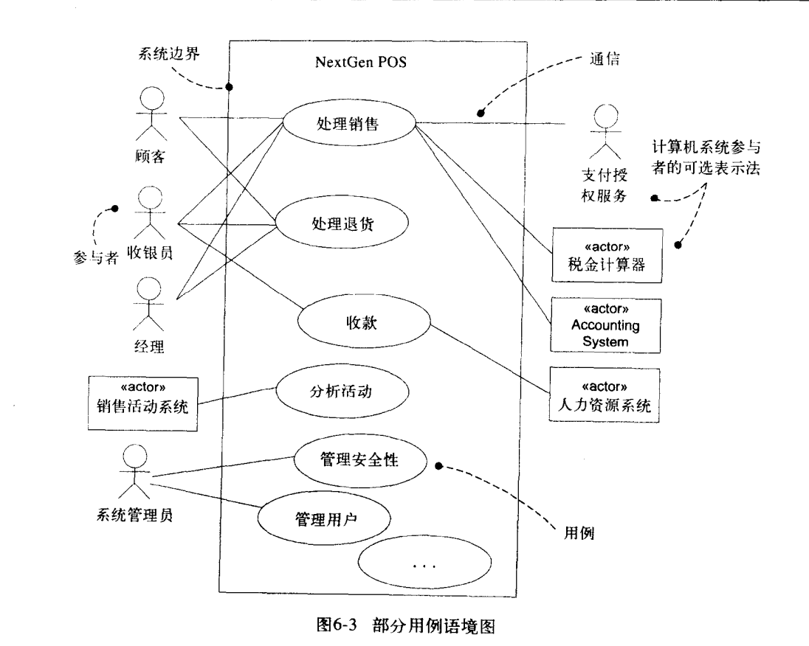
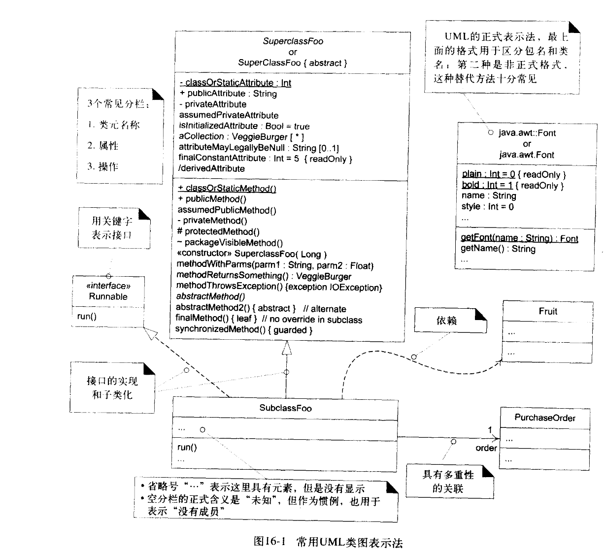
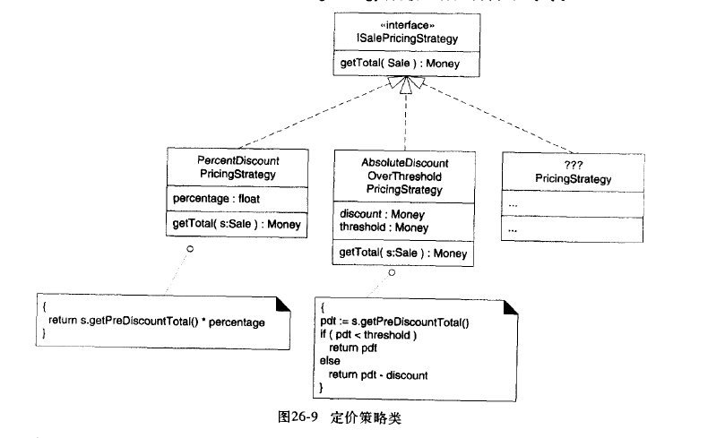
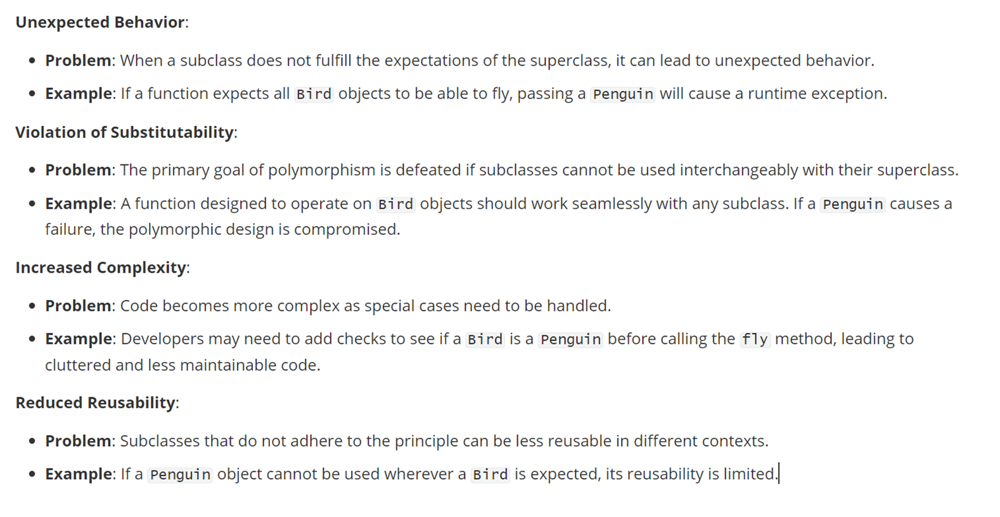

## 1 初始阶段中确定用例 use case

**用例是一组相关的成功和失败场景的集合，用来描述参与者如何使用系统来实现其目标。**

**参与者：** 某些具有行为的事务。

**场景：** 使用系统的一个特定情节或用例的一条执行路径。如使用现金购买商品的场景。

**用例模型是文本的形式存在的。**用例编写是涉及的领域：场景、范围、级别、主要参与者 main actor、**涉众及其关注列表**、前置条件、后置条件、**主成功场景（完成某个目标进行的场景的集合，有顺序）**、扩展（替代流程）、技术和数据变元表

- UML 用例图

main actor 放在左边，辅助actor放在右边。中间是一个一个用例。

## 2 细化迭代一

### 2.1 GRASP 设计模式
目标：学习面向对象设计的5个GRASP原则或模式。

#### 2.1.1 Creator 模式

解决OOD中对象的创建问题

建议：当以下条件部分存在时，将创建类A对象的职责分配给类B

- B包含A，或者说A是B的组成部分之一；
- B记录A
- B紧密地使用A
- B具有A初始化时使用的数据

#### 2.1.2 Information Expert 模式

类对象信息的持有者，可以充当信息专家。

问题：给对象分配职责的基本原则是什么？
  
建议：把职责分配给具有完成该职责所需信息的那个类。完成某个职责尽量不要去访问别的类的信息，而是使用自己的类的信息。可以调用专家类来查询所需的信息。

#### 2.1.3 Low Coupling 低耦合模式
coupling：元素与其他元素之间的连接、感知及依赖的程度的度量。

问题：如何减少因变化产生的影响？

解决方案：分配职责以使不必要的耦合保持在较低的水平。用该原则对可选方案进行评估。

信息专家的设计同时也能体现低耦合的设计。

#### 2.1.4 Controller 模式
问题：在UI层（前端）之上的那个对象应该首先从UI层接收该消息呢？也就是user在UI界面触发的事件会发送请求，这些请求最先会被领域层中接收。

解决方案：把这个职责分配给能代表下列选择之一的对象：

1. 代表全部“系统”，“根对象”，运行软件的设备或主要的子系统
2. 代表发生系统操作的用例场景（用例或者对话）

#### 2.1.5 High Cohesion 模式

问题：怎样使对象保持有内聚、可理解和可管理，同时具有支持低耦合的附加作用

解决方案：选择保持高内聚的方案，将工作委派和分配给其他的合适的对象。在一个模块或者类中的元素紧密联系，共同完成该模块的任务。即类中的元素的存在都是为了该类所负责的职责而存在的，不能与其他的模块产生联系。

#### 2.1.6 Indirection 模式

间接性是在两个事物或多个事物中间作为中介，将提供服务方的接口隐藏到自己的接口中，并对接收服务端开放，达到避免直接耦合的作用。

计算机科学中有句名言：**“计算机科学中的大部分问题都可以通过添加一层间接性来解决。”**降低事物之间的耦合性的重要性可见一斑。

实现构件之间的低耦合，涉及到大量的GoF模式，而且大量的间接性中介都是纯虚构的。

#### 2.1.7 Pure Fabrication 纯虚构
问题：当你不想违背高内聚和低耦合时，但是基于专家模式所提供的方案不合适时，那些对象应该承担这一职责？

解决方案：对人为制造的类分配一组高内聚的职责，该类并不代表问题领域的概念，是一个虚构的事务，用来支持高内聚和低耦合。这种类是凭空虚构的。

#### 2.1.8 Polymorphism 多态性
问题：如何处理基于类型的选择？如何创建可插拔的软件构件

解决方案：当相关选择或行为随类型（类）有所不同时，使用多态操作作为变化的行为类型分配职责。

准则：何时使用接口进行设计

多态要求大量使用抽象类或接口，当你想要支持多态，又不想约束与特定的类层次结构时，使用接口，反之使用超类。

#### 2.1.9 Protected Variations 防止变异

问题：如何设计对象、子系统和系统，使其内部的变化或不稳定性不会对其他元素产生不良影响？

解决方案：
- 识别预计变化或不稳定之处，分配职责用以在这些变化之外创建稳定接口。

**源于防止变异的机制**

- Data-Driven Design
- Service Lookup
- Interpreter-Driven Design
- Reflective or Meta-Level Design
- Uniform Access

不要跟陌生人讲话原则

## 3 UML 类图

## 4 类关系

### 4.1 依赖 dependence

- 依赖在UML类图中使用从客户到提供者的虚线箭头表示

如何确定一个类是另一个类的依赖呢？
- 拥有提供者类型的属性，客户类拥有提供者类的实例作为其属性
- 向提供者发送消息。调用提供者的方法
- 接收提供者类型的参数，类方法中接收提供者实例作为参数
- 提供者是超类和接口，自己是子类或接口的实现者。

### 4.2 聚合 aggregation
模糊的关联，不精确的暗示了整体-部分的关系。

### 4.3 组合 composition
一种很强的整体-部分聚合关系。组合有着以下几层含义：
1. 在某一时刻，部分的实例只属于一个组成实例
2. 部分必须总是属于组成，不能脱离组成单独存在
3. 组成负责创建和删除部分，能保证部分不会脱离组成而存在；组成销毁，到导致部分的销毁。
4. 用带有实心菱形箭头的关联线表示组合关系，箭头方向指向组成类。

### 4.4 泛化 generalization
在多个概念中识别共性和定义超类和子类关系的活动。

## 5 特殊类

### 5.1 单实例类
在系统中只允许存在一个实例的类，比如GoF设计模式里的工厂类，在UML类图中该类的视图的右上角标注1.

### 5.2 模板类和接口
模板类的右上角表面模板符号

### 6 GoF 设计模式

**设计模式一共有23种，接下来我会一一介绍。由于设计模式并非全部都是实用的，所以我会针对常见的15种模式进行详细的介绍，其他模式做简单的介绍。**

在介绍GoF设计模式之前，我先阐述一些基本的概念。

## 适配器 Adapter

问题：如何解决不相容的接口问题，或者如何为具有不同接口的类似构建提供稳定的接口？

解决方案：通过适配器将构件的原有的接口转换为其他的接口。使用接口和多态

一个事物可能会使用到不同的第三方服务，可能存在类似服务但接口都不尽相同。为了提供稳定的接口，可以采用增加一层间接性对象，也就是适配器，把不同的外部接口调整为在应用程序内使用的一致接口。

### 工厂（Factory）

工厂，也叫简单工厂或者具体工厂。

介绍Factory设计模式之前，引出一个问题。前面介绍的适配器，有没有想过在实际编程中，是由什么对象进行创建的。如果把适配器的创建交由需要这个适配器的对象进行创建，则又会使得该对象的职责越位，这是不建议的。

这一点可以在一个基本设计原则中反映，**设计要保持关注分离（separation of concern）**。

为解决这个问题，便需要工厂模式。Factory可以分离复杂的创建的职责，并将器分配给内聚的帮助者对象；同时隐藏潜在的复杂创建逻辑；允许引入提高性能的内存管理策略（对象缓存和再生）。

具体做法：**创建一个工厂的纯虚构对象来处理这些创建职责**

### 单实例类(Singleton)

不知道读到这里有没有发现，适配器上存在的问题，在工厂上也同时存在（U•ェ•U），谁来创建工厂对象实例呢？

这里介绍一种解决方案：单实例类

单实例类是只能拥有唯一实例的类。且实例的创建要对全局可见和单点访问，对类定义静态方法getInstance用以返回单实例。

### 策略设计模式

问题：

如何设计变化但相关的算法或政策？如何设计才能使这些算法或政策具有可变更的能力

解决方案：

在单独类中分别定义每种算法、政策、策略，并且使其具有共同接口

利用多态设计根据对象进行动态变化的不同策略，这里的策略可以是解决某问题的算法，或者政策，针对不同的对象实例的相同问题需要不同的算法。

创建这些算法对象同样的可以采用工厂模式进行分发。

### 组合 Composition 设计模式

问题：

如何能够像处理非组合（原子）对象一样，多态地处理（多个）一组对象或者具有组合结构的对象呢？

解决方案：

定义组合和原子对象的类，是他们能够实现相同的接口。定义一个具有组合性质的类，实现接口，在多个子类中重写接口

基类是组合，子类是部分，重写基类的部分方法

### 外观 Facade

问题：

对一组完全不同实现或接口需要公共的、统一的接口。可能会与子系统内部的大量事物产生耦合，或者子系统的实现会被改变，怎么处理？

解决方案：

对子系统定义的唯一的接触点---使用Facade对象封装子系统。该Facade对象提供了唯一和统一的接口，并负责与子系统构件进行写作。就是将子系统隐藏在一个对象之后，防止子系统产生编译

### Observer （Publish-Subscribe）

问题：不同类型的Subscriber对象关注着Publisher对象的状态变化或事件，并且想要在Publisher对象产生事件时，自己以特殊的方式做出响应，同时Publisher想要和Subscriber保持低耦合，即Subscriber并不知道Publisher的存在。

解决方案：定义一个Watch接口（监听器），Subscriber实现该接口，发布者动态注册关注某事件的Subscriber，并在事件发生时通知。

就是将订阅者的一部分需要发布者的功能提取出来当做接口，这样发布者就是和接口耦合而不是订阅者。

## 历年考试简答题常考
1. What is design pattern?

A pattern is a named problem / solution pair that can be applied in new contexts, with advice on how to apply it in novel situations and discussion of its trade-offs

2. explain GRASP and GoF
GRASP: General Responsibility Assignment Software Patterns. 描述了对象设计和职责分配的基本原则

3. What is an iteration? 

iteration refers to a single development cycle in which a set of tasks or activities are completed. It is a single execution of a set of instruction that are to be repeated until a specified result is obtained

What are the benefits of Iterative Development?

  ① Critical risks are resolved before making large investments.

  ② Initial iterations enable early user feedback.

  ③ Testing and integration are continuous. 

  ④ Objective milestones focus on the short term. 

  ⑤ Progress is measured by assessing implementations. 

  ⑥ Partial implementations can be deployed. 

  ⑦ Each iteration produces an executable release, an additional increment of the system an it includes integration and test.

3. What is Liskov substitutability principle?里欧替换原则

- Objects of a superclass should be replaceable with objects of a subclass with affecting the correctness of the grogram 

4. 
5. What is Open-Close principle

Software entities should be open for extension but closed for modification

6. What is UML
- The UML is a language for visualizing, specifying, constructing, documenting the artifacts of a software-intensive system

benefits:
- 构建UML模型可以帮助我们更好的理解软件
- UML构建的模型是精确的，是不荒料的，是可实现的
- UML模型可以被编程语言实现

7. 什么是RUP，列举4个phase和9个workflows

- RUP（rational统一过程）强调使用迭代和增量开发方法，旨在通过一系列预定义的阶段来管理软件项目的各个方面，包括需求、设计、编码和测试。
- inception elaboration construction transition
- principle,business modeling,requirements,analyse and design,implementation test,deployment,configuration and change management,project management,environment