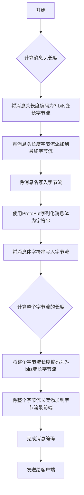

我在网络框架这一篇中介绍如何使用7-bits编码方法解决tcp的粘包问题，不仅仅是tcp的字节流，我们内部自己的消息也存在这样的问题。我将在本节具体介绍我们如何继续使用7-bits编码方法将设计的消息结构体编码成一个可解析的字节流。

假设现在有这样一个消息，负责回复客户端的加入请求。我们称之为join_reply消息。所有proto消息都由两部分构成，消息名和消息体。消息名用于标识消息的类型，使得客户端能够知道使用什么proto解析方法去解析消息体，消息体则包含具体的数据内容。

为了解决消息头和消息体之间的粘包问题，我们采用以下编码方式：首先，计算消息头的长度，并将其编码为7-bits的变长字节流，添加到最终的字节流中。然后，将消息名写入字节流。接着，使用ProtoBuf将消息体序列化为字符串，并写入字节流。最后，计算整个字节流的长度，同样编码为7-bits的变长字节流，并添加到字节流的最前端。这样就完成了消息的编码，可以安全地发送给客户端。

