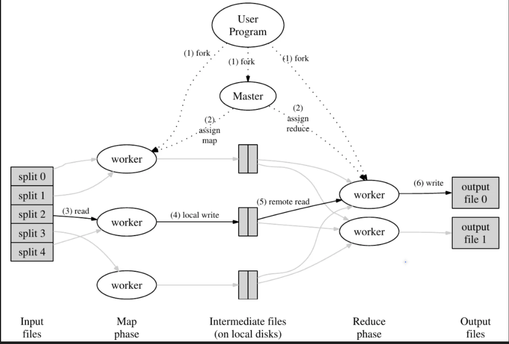

# 前言
久仰MIT6.5840大名，现开始做它的Lab。本篇讲下MapReduce这个Lab的基本流程。这里提供[MapReduce的论文](https://link.zhihu.com/?target=http%3A//research.google.com/archive/mapreduce-osdi04.pdf)。这篇论文非常经典，值得一读，是经典的分布式任务框架。

# MapReduce
要完成这个实验其实不需要把MapReduce这个框架研究多深，只需要理解Coordinator和Worker之间是如何通信协作的就可以。甚至实验代码中把Map和Reduce函数也提前给你了。首先贴一张MapReduce论文里的截图：



图中的Master节点我称为Coordinator节点，理解这张图可以知道，MapReduce的框架主要分为两个部分，Coordinator和Worker。Coordinator负责分发任务，Worker负责执行Map和Reduce任务。设计的难点在于两个地方：明确协作流程和分配任务。

明确协作流程解决比较简单，就是使用rpc框架，Worker调用Coordinator的rcp接口进行协作。这里设计的接口有两个，一是请求任务接口，二是任务完成通知接口。Worker Process启动后，不断向Coordinator调用请求任务接口得到需要进行的任务，执行完成后通知Coordinator任务完成。

Worker负责执行的任务有两个类型：Map和Reduce。Map要先于Reduce，Map的输出文件是Reduce的输入文件。Map任务会对处理的Key进行哈希处理，并分配到R个Reduce任务上，所以代号为m的Map任务可能会产生R个中间文件。看到这里，应该知道Reduce文件要如何认领自己的中间输入文件了。就是Map会产生R个中间文件，命名格式可以约定为mr-m-r。等所有的Ma任务都完成后，Coordinator开始分配Reduce任务时，Reduce的输入文件就是所有的mr-*-r文件。那么为什么要对Key进行哈希处理呢？这是为了让相同Key的数据在同一个Reduce任务上处理，变相实现了排序方便Reudce进行统计。

然后来讲讲Coordinator分配任务的逻辑，这个问题看似是这个Lab的重头戏，但是其实也好解决。Coordinator启动时，会知道需要处理的文件个数，这就是Map任务的数量，还有提前约定好的Reduce任务数量。Coordinator一开始就可以初始化所有的待分配任务。这里用Taskinfo结构体来储存任务信息，TaskStat结构体来储存任务状态，TaskStat队列储存所有的任务。

```go
type TaskInfo struct {
	M        int    // 共M个Map任务
	R        int    // 共R个Reduce任务
	m        int    // 当前第m个Map任务
	r        int    // 当前第r个Reduce任务
	filename string // 文件名
	role     int    // 任务类型
}

type TaskStat struct {
	Assign   bool     //分配状态
	Timestamp int64    //时间戳
	Done     bool     //完成状态
	TaskId   int      //任务ID
	Taskinfo TaskInfo //任务信息
}
```

这样就能方便Coordinator来分配任务了。注意任务的分配分为两个阶段，一个是Map阶段，一个是Reduce阶段。Map任务全部报告完成后才可以开始Reudce任务的分配。这里的任务分配逻辑是，每次Worker请求任务时，Coordinator会从TaskStat队列中找到一个未分配的任务分配给Worker。Worker完成任务后，会通知Coordinator，Coordinator会更新TaskStat队列中的任务状态。这样就完成了任务的分配。

多个Worker并发的请求任务，Coordinator如何线性得分配任务呢？这个场景是不是很像消费者生产者模型？是的，配合GO的channel可以无锁的解决这个问题。我们要知道Worker发过来的消息有两个类型，一个是请求任务，一个是任务完成。那么就设计两条消息通道，一个是任务请求通道，一个是任务完成通道。Coordinator只需要不断的从任务请求通道中读取请求，然后从TaskStat队列中找到一个未分配的任务分配给Worker，然后把任务信息写入任务完成通道。Worker只需要不断的从任务完成通道中读取任务完成信息，然后更新TaskStat队列中的任务状态。这样就实现了任务的分配。

这里不得不感叹go对于并发的方便好用，如果是用别的语言和锁来控制，工程量无疑会大很多。

最后就是容错机制的设计了。

这里我选择laziest的方法，不用在Coordinator去维护各个Worker的状态，Worker是stateless的。Coordinator会去维护Task的状态，设定一个超时时间，如果被分配的task超时没完成，就会重新可以被分配（认为之前的Worker挂了。但是这里会有个问题，就是worker如果从错误中恢复过来，并且向Coordinator发送任务完成，这里就会出现重复完成的任务，也就是会有两个worker产生同样的中间文件。

解决的办法就是保证生成文件的原子性，这样后来完成的worker会将结果覆盖上去，也没有影响。如何保证呢？先创建temp文件，写入数据后在重命名为正式文件名。这样就保证了原子性。


看到这里，整个lab的脉络就非常清晰了，实现起来估计就不难了。

